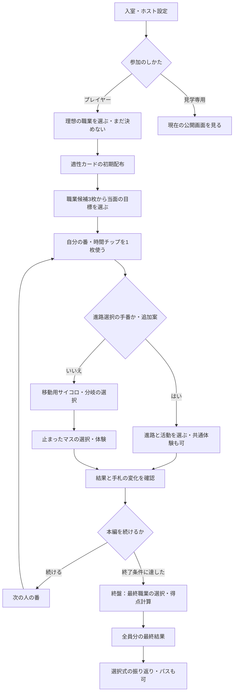

# みらいルート：実装担当への引き継ぎ

作成日：2026-09-27

状態：企画・画面設計の引き継ぎ資料。実装開始や本体公開を自動的に承認するものではない。ユーザーは実装を実装モデルで行う予定とし、必要に応じたfalによる画像生成も許可している。この資料の作成時点では新たな画像生成は行っていない。

ルール・職業カード・得点式の詳細は [設計メモ](career-boardgame-design-v1.md) を参照する。担当と権限は [AIの役割定義](ai-roles.md) に従う。

## 最初に共有する体験

参加者が職業と適性のカードを集め、すごろく上で体験を選びながら、最後に1つの職業を選ぶゲーム。育てる適性、試す体験、協力に使う時間、職業の選び直しに遊びとしての意味を持たせる。すべて選択式で、自由記述や理由の発表を進行条件にしない。

適性の初期配布とサイコロはゲーム上の偶然。本人の能力・適職の診断ではない。ゲーム得点の比較と、内省の回答・成長評価の保存や比較を混同しない。

## 全体の流れ

以下は画面を設計するための順序案。各箱は状態・画面のまとまりであり、すべてを別ページにする必要はない。

見学専用の画面は本編・終盤・公開結果に追従する。見学者の入力を待って進行を止めない。終盤の追加処理は逆転案A/Bの選定によって異なるため、この図ではどちらかを採用済みとは扱わない。

進路の追加案は、高校などを選ぶ序盤と、大学・短大・専門学校・就職などを選ぶ中盤の節目を想定する。回数・表示タイミングは未確定。通常の手番を進路選択に置き換える案であり、その手番に移動と別のマス処理を重ねない。

### 1回の手番

「誰の番か」→「移動」→「止まったマスで何をするか」→「結果」→「次の人」の順。イベント判定用のサイコロは移動用と別にする。確定でカードを得るマスではイベント判定を追加しない。

| 止まったマス | 選ぶこと・表示すること |
|---|---|
| 適性を伸ばす | 持っている適性から、増やすカードを選ぶ |
| 新しい体験 | 適性候補から、試すカードを選ぶ |
| 職業との出会い | 職業候補3枚から追加する1枚を選ぶ |
| 個人イベント | 取り組み方を選び、サイコロで判定する |
| コラボ | 相手を招待し、承諾した人とそれぞれ役割・判定を行う |
| 暮らしのイベント | 暮らしで行う活動と一時的な効果を見て選ぶ。今回は選ばないこともできる |

これらのランダムなマスに加え、進学・就職の節目を表す進路選択の手番を検討する。進路では選んだ活動に対応する適性カードを1枚確定で得る案とし、暮らしのサイコロ補正とは分ける。

通常のスキップでは開始時に消費した時間チップを二重に減らさない。タイムアウトで確定済みの移動やカード獲得を巻き戻さず、未実行部分を見送る。コラボを断ることは通常手番のスキップと別で、招待された人の時間チップを消費しない。

## 必要な画面・状態

| 画面・状態 | 中央に見せる内容 | 主な操作 |
|---|---|---|
| 入口 | ゲーム名、参加・見学、ルームへの入り方 | はじめる／参加する／見学する |
| 待機・ホスト設定 | ホストの役割、プレイヤー数と見学者数、時間・手番設定 | 設定して開始する |
| 理想の選択 | 職業の説明と候補。「まだ決めない」も表示 | 選ぶ／別の候補を見る／まだ決めない |
| 初期の手札 | 配られた適性と、それぞれの短い説明 | 確認して進む |
| 当面の目標 | ランダムな職業候補3枚 | 1枚を選んで確定 |
| 進路選択・追加案 | 高校の学科、その後の進学・就職などと活動の候補 | 進路→活動の順に選ぶ。進路を決めず共通体験を選ぶことも可 |
| すごろく | 誰の番か、現在地、近くのマス、時間チップ | 移動用サイコロを振る／分岐を選ぶ |
| イベント | 場面、番号付きの選択肢、狙える効果と時間コスト | 選ぶ→確認→必要なら判定 |
| イベント結果 | 出目・補正、獲得、更新後の手札 | 必要なら報酬を選ぶ→手番を終える |
| 待ち時間 | 今の人の公開イベントと次の順番 | 自分のカードの説明を見る |
| 一時的な見学 | 公開中のゲーム、保持している手札、時間の扱い | 次の自分の番から戻る |
| 見学専用 | 公開盤面・公開選択肢・確定した結果 | 説明を見る／退室 |
| 終盤 | 選定した終盤ルール、保持する職業から最後の1枚 | 最後の職業を確定。追加処理はA/Bで異なる |
| 最終結果 | 選んだ職業と得点の内訳、複数人ならゲーム順位 | 結果を確認して進む |
| 振り返り | はじめの理想と最後の選択を振り返る、軽い選択肢 | 選ぶ／今回はパス。回答を保存・採点しない |

ホストは「進行のみ」でも「自分も参加」でも進行管理を使える。参加者に管理ボタンを見せない。画面共有で操作を代行する場合は、本人が番号などで伝えた選択を反映する。

### 終盤の順序を混同しない

- 案A：最終職業を選択→通常得点を計算→希望者が仕上げチャレンジ→全員の結果を公開。
- 案B：再挑戦チップの交換と最後の職業候補の追加→最終職業を選択→通常得点を計算→全員の結果を公開。
- A/Bは未決定。両方を同時に初期ルールへ入れない。数値と注意点は設計メモを参照する。
- プレイヤーが1人なら、架空の対戦相手や順位を作らず、その人のゲーム得点を表示する。

## 要望と試作提案の区別

### ユーザーの要望として引き継ぐもの

- 選択式のキャリアデザインすごろく。ポイントで遊びとして競う。
- 初期の適性カード、ランダムな職業候補からの選択、別に選ぶ理想の職業。
- 適性を伸ばす・新しい適性を発見する・職業を保持して選び直す体験。最後は1職業を選ぶ。
- サイコロによる不確実性、他の参加者とのコラボ、協力のために使う時間。
- 結婚、自動車や家の購入、子どもが生まれるなどのライフイベントを検討する。
- 高校入学、大学進学、専門学校、就職などの進路を含め、普通科や専門分野などの選択がゲーム内の適性の変化につながるようにする。
- ホスト1人＋参加者1人でも成立し、6〜7名程度の参加にも対応する。ホストは参加するか進行に徹するか選べる。
- 45分以内を目標にし、人数で手番回数を選べる。
- 職業を増やす、途中で負けが確定しにくくする、スキップ・時間制限・見学を扱う。

### 試作上の提案であり、確定扱いしないもの

- 名称「みらいルート」、6種類の適性、初期の適性3枚、各種類3枚まで、職業24枚、最大15点の配点。
- 理想の職業を保持する1枚に含め、初期の職業を合計2枚にすること。
- プレイヤー総数1〜8人、人数別の時間チップ初期値、30秒＋15秒延長、コラボ返答10秒。
- 暮らしのイベントの次の2判定への+1/-1、初回1人1回という制限。
- 進路を序盤・中盤の2回に分け、選んだ活動から適性1枚を得る追加案。高校の学科と専門学校を分け、進路名だけで能力を固定しない。通常手番との置き換えと短い回での回数は未確定。
- ゲームの所要時間の計算値。実際の45分以内を保証する検証はまだない。

## 実装前に整理する残りの判断

| 項目 | 決めること | 未決定のまま進められる部分 |
|---|---|---|
| 逆転 | 案Aの最後の運か、案Bの育成と職業選択か | 通常の配布・移動・イベント・得点内訳 |
| 盤面 | 長さ、分岐、マスの比率、端に到達したときの処理 | 各マス単位の画面・処理 |
| 進路イベント | 段階・回数・通常手番との置き換え、コラボで時間が減った人や休憩後の提示 | 進路→活動の選択画面、確定獲得と共通体験の処理案 |
| 選択可能なカードがない場合 | 適性がすべて上限・職業をすべて保持したときの代替 | 通常の候補提示と上限処理 |
| 操作方式 | 画面共有でのホスト操作、各自の端末からの操作、その併用範囲 | 単一端末の画面遷移と選択操作 |
| 初期選択・終盤の締め切り | 無反応の人の準備待ち、保留から戻れる期限、確定後の変更 | パス・保留状態の表示と他の人の進行 |
| 画像と具体的イベント | 収録する文章・絵柄、ライフイベントの種類と頻度 | 仮素材による配置と読める文字の表示 |
| 見学者の人数 | 同期方式・想定端末に応じた上限 | プレイヤーと別の人数・権限・待機条件 |

判断が必要な箇所を黙って製品仕様として確定しない。試用のために仮の挙動を置く場合は、仮定と影響を記録し、独立した設定や処理として差し替えられるようにする。

## 進学・就職の追加案の注意点

- 詳細・活動例・用語の確認元は、設計メモの「進学・就職を扱う進路イベントの追加案」を参照する。これまでの学校関連の話題を避ける方針に対して、今回はユーザーが進学・就職と学科の選択を明示的に希望したことを引き継ぐ。
- 高校の普通科・専門学科・総合学科と、高校段階の後の専門学校を同じ階層に混ぜない。現実の進路制度をすべて再現する実装は求められていない。
- 進路名→活動の選択→適性カードの獲得という対応にする。同じ進路に複数の活動を設け、進路だけで適性を決めない。進路名による追加得点や最終職業の制限も入れない。
- 初回案では、選んだ活動の適性を1枚確定で追加する。既存の適性なら成長、新しい適性なら発見として見せる。各種類3枚の上限は維持する。
- 進路による継続補正は初回案に追加しない。この確定獲得に暮らしの補正を使わず、その残り回数も減らさない。
- 進路を決めない場合は、学校・就職のラベルを持たない共通の体験から、同じ1枚を得る機会を置く案。体験もスキップできる。現実の志望校・進路希望を入力させたり、本人の希望として保存したりしない。
- 中盤の就職は仕事を経験するルート。最後の職業をここで固定せず、以後も職業の追加・目標変更を可能にする。
- 4手番のうち2回を進路に使うと自由な体験が減る。回数と時間の見積もりを再検討し、既存の45分の見積もりを新仕様の実測値として扱わない。
- 会話内の触れる画面案には、まだ進路イベントを追加していない。今回の追加は企画・引き継ぎ文書であり、本体コンテンツへの投入や支援方針全般の変更を承認したものではない。

## アニメーションの引き継ぎ

ユーザーは必要な場面へのアニメーション追加を希望している。場面別の仕様は設計メモの「アニメーションの使い方」を参照する。

- 会話用画面案には、選択時180ms、判定準備の表示200ms、確定したサイコロの動き500ms、獲得カード350msを追加した。
- 盤面の駒移動と職業カードの追加演出は本体実装の候補。まだ会話用画面案には含まれない。
- 確定値と次の操作はすぐ表示する。演出の完了を、獲得・手番終了・同期の成立条件にしない。連打や演出中断でも判定と獲得は1回。
- 端末の`prefers-reduced-motion`と画面内の「動きを減らす」を尊重する。静止表示でも結果が読め、進行や得点は変わらない。
- 演出は初期表示・待機中・再接続時に自動で繰り返さない。各端末の演出速度や設定を理由に他の人の進行を待たせない。
- PC・スマートフォンで通常表示と動きを減らした表示を確認し、演出中に次へ進んでも値が重複更新されないことを検証する。

## 画像を使う場合の方針

全体の流れは上の遷移図と実際の画面遷移で示す。falの画像は、街の雰囲気や職業・イベントの場面を補うために使う。

| 候補素材 | 表現するもの | 画像に含めないもの |
|---|---|---|
| 盤面の背景 | さまざまな仕事や体験に出会う、落ち着いた街 | マス番号、ルート分岐、駒、ボタン、文字 |
| 職業カードの絵 | その仕事で扱う道具や活動。カード間で画風をそろえる | 職業名、配点、適性アイコン、得点計算 |
| イベントの挿絵 | 何をする場面かが伝わる短い情景 | 選択肢、判定条件、成功・失敗を先に決める表現 |

文字、選択状態、ルート、得点、サイコロ結果は画面側で描画する。画像が読み込めなくても、説明文と操作で最後まで遊べる設計にする。画像素材が必要になった時点で対象と画風を絞って生成し、最初から全職業・全イベント分を一括生成しない。

## 既存の画面案

会話内の触れる画面案のソースは、この端末の次の場所にある。

`/Users/tagishimasakatsu/.codex/visualizations/2026/09/27/01a0e2b6-6ede-7df2-992c-44964a8b1353/career-ui.html`

HTML断片形式の画面参考であり、ゲーム本体のひな型ではない。会話側の表示機能を前提にする部分がある。別環境へ渡す場合は、このファイルも別途共有するか、設計メモのUI節を参照する。

- 対象：架空の手札での3択→判定→報酬選択・手札更新、スキップ、一時見学、延長表示。
- 未実装：実時間のタイマー、盤面移動、全マス・全職業、複数人同期、実際の手番切替、終盤・得点集計。
- ブラウザで確認済み：選択・判定・別の適性の報酬選択と手札更新、スキップ、一時見学からの復帰、延長表示。幅1024pxの操作、幅320pxの表示と手札の折りたたみ。確認時のコンソール警告・エラーなし。
- アニメーション追加後の確認：PCで通常表示と画面内の「動きを減らす」を切り替え、判定・カード更新・手番終了が進むことを確認。幅320pxで設定と画面が横にはみ出さないことを確認。JavaScript構文・参照する要素の存在の検査、リポジトリのlintも合格。端末の動きを減らす設定の変更、および複数端末の同期は実機未検証。
- 画面設定で切り替える見学専用表示などは実同期での検証ではない。画面確認の結果を、ゲーム全体や全分岐のテスト完了に読み替えない。

## 作業ツリーと検証の引き継ぎ

- 参照したHEAD：`a10f69654e2c180b08f7b60e9796a62d349ca3b8`。
- この企画の対象：`docs/career-boardgame-design-v1.md`、この引き継ぎ資料、上記の会話用画面案。作成時点で企画文書は未コミット。
- 別作業の変更あり：`apps/magire-eshi/AGENTS.md`・`index.html`・`slides.html`、`apps/value-card/AGENTS.md`・`app.js`・`index.html`・`style.css`、`apps/updates.json`。また、未追跡の`.playwright-cli/`と`output/`がある。今回の企画差分として混ぜたり、取り消したりしない。
- 直前の画面設計の作業単位で`bash scripts/lint.sh`は終了コード0、問題なし。この引き継ぎ作業は文書のみ。新たに実装した差分に、この結果をそのまま流用しない。
- 配点の机上確認と45分の試遊は別。確認済み・未検証の詳細は設計メモ末尾を参照する。

## 実装を依頼するときの指示案

次の文章は、オーナーが実装を依頼するときに使うためのひな型。この資料だけを根拠に別のエージェントを起動したり、実装・公開を開始したりしない。

> ルートAGENTS.mdとdocs/ai-roles.mdを読み、docs/career-boardgame-handoff.mdを入口に、docs/career-boardgame-design-v1.mdの企画を具体化してください。最初はdrafts/内の未公開試作として、入室相当の開始画面から初期配布、すごろくの手番、最終職業の選択・得点表示まで流れを確認できるものを作ってください。ユーザーの要望と試作上の提案を区別し、未決定の逆転ルールなどを承認済みとして固定しないでください。判断に依存しない画面・処理は先に進め、仮定は記録してください。
>
> 試作はPC・スマートフォンで確認してください。同期を追加する段階では該当する共通仕様を読み、承認済みの検証環境を使ってください。見学専用と一時的な休憩を区別し、ホスト1人＋参加者1人、ホストが参加する場合、参加者6〜7人、スキップ・復帰・時間切れが成立するか検証してください。ゲーム得点と本人の内省・成長評価は分け、内省の回答の保存・採点・自動推薦は追加しないでください。
>
> 高校の学科、大学・短大、専門学校、就職などの進路イベントも追加案として扱ってください。進路だけで適性を固定せず、その場所で選ぶ活動からカードを得る設計にしてください。進路を決めない共通体験も用意し、通常手番との置き換え・回数・所要時間を検討してください。未確定の表示タイミングを、承認済みとして固定しないでください。
>
> 必要な画像素材にはfalを利用できます。まず文章と仮素材で流れを確認し、画像に文字や操作を焼き込まず、差し替え可能にしてください。選択・サイコロ・カード獲得・駒移動には、設計メモに沿った短いアニメーションを必要に応じて加え、動きを減らした表示にも対応してください。演出の終了待ちをゲーム進行の条件にせず、操作や獲得を二重に処理しないでください。既存の別作業の差分を保護し、変更禁止パスには触れないでください。apps/への投入・公開はオーナー専任です。完了時は対象差分、動作確認、未検証事項、残る判断を報告してください。
