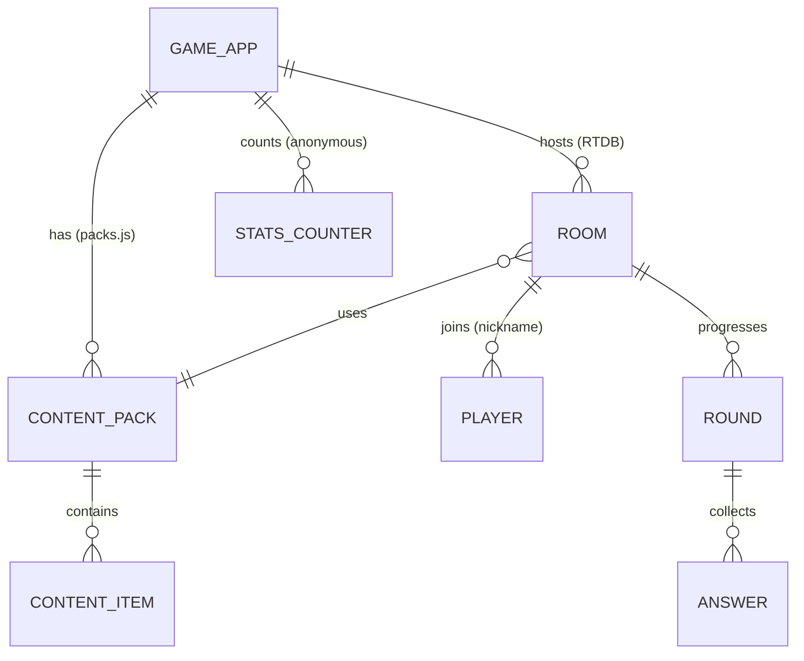
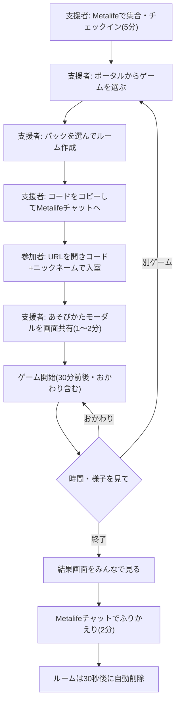
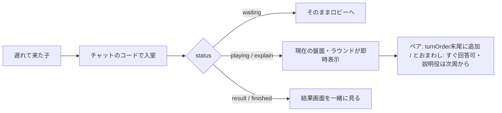
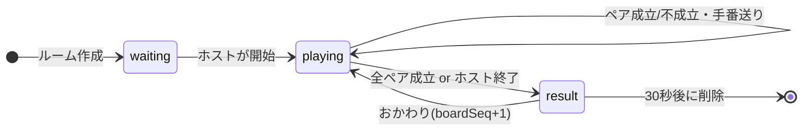
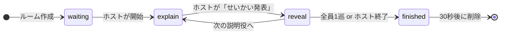

# コトバであそぼ！ ゲームアプリ群 要件定義書

- 作成日: 2026-08-09
- ステータス: **承認済み・実装済み**（2026-08-09 オーナー承認「おまかせします」。未決事項1〜9は第34章の推奨案どおり確定。本書が「コトバであそぼ！第2期（ゲーム版）」の正本）
- 改訂記録:
  - 2026-08-10 オーナー指示により「**コトバの技クイズ**」（`kotoba-waza`）を追加。45分枠の「きょうのコトバの技」スロット（5〜10分）を、3択ミニクイズ（技ごとに4問・17技）＋「きょうのゲームでつかってみよう」の橋渡し画面で担うオフラインアプリ。第7.1章の技紹介の記述を上書きする（従来の「口頭＋howto画面共有」から変更）
  - 2026-08-10 オーナー実機フィードバックにより3点変更。(1)コトバペアは**裏向き（神経衰弱型）を既定モード**とし、**ペア成立時は手番継続**（表向きは相談向けオプションとして残し交代制のまま） (2)画面文言は**通常表記（漢字まじり）**。読み上げはファシリテーターが補完（10.2の旧記述を上書き） (3)ルームコードのコピーは**コード単体**（既存アプリと同一挙動。10.1の旧記述を上書き）
- 対象読者: 本リポジトリの開発者（人間・AI とも）。本書だけで目的・仕様・MVP範囲・DB・画面・ゲームルールを理解し、実装計画を立てられることをゴールとする

---

## 0. この文書について

### 0.1 本書の位置づけ

「コトバであそぼ！」は room-K の国語ワークショップ枠（45分）である。第1期はスライドエンジン型アプリ `apps/kotoba-asobo/` として実装されたが、実機での使い勝手の問題により 2026-08-07 に公開終了した（コミット 3f99a2a）。本書は**ゲーム主導へ発想を転換した第2期**の要件定義書である。

本書は新規のプラットフォーム構想ではなく、**既存リポジトリ roomk-tools への追加**として書かれている。既存の共通規約（[AGENTS.md](../AGENTS.md)）と競合する記述があった場合は AGENTS.md が優先し、本書側を直す。

### 0.2 関連文書

| 文書 | 関係 |
|---|---|
| [AGENTS.md](../AGENTS.md) | 共通実装ルールの正本。本書はこれに従う前提で書かれている |
| [docs/kotoba-asobo/](./kotoba-asobo/) | 第1期の設計資料。**年間計画（02）と系統表（03）は「学習テーマの素材マップ」として第2期でも参照する**。スライド仕様（04）は失効 |
| [apps/kotoba-tantei/AGENTS.md](../apps/kotoba-tantei/AGENTS.md) | 既存ゲーム「ことば探偵」の正本。本書 GAME 2 が採用する |
| [apps/tatoe-narabe/AGENTS.md](../apps/tatoe-narabe/AGENTS.md) | 既存ゲーム「たとえならべ」の正本。本書 GAME 3 が採用する |
| [docs/ai-roles.md](./ai-roles.md) | AI の役割分担。実装フェーズで参照 |

### 0.3 用語

| 用語 | 意味 |
|---|---|
| 支援者 | room-K のメンター・スタッフ。アプリ上の役割は「ホスト」 |
| 参加者 | 子ども（小学校中学年〜中学生）。アプリ上の役割は「ゲスト」 |
| ルーム | 1ゲーム1回分のオンライン対戦部屋。6桁コードで入室。終了後に削除 |
| パック | ゲームに差し込む問題・お題のまとまり（静的データ）。「同じゲーム × 違うテーマ」を実現する単位 |
| 参加スタイル Lv.1〜3 | Lv.1=見る・選ぶ / Lv.2=答える / Lv.3=作る・説明する。**内部用語であり、子どもに見せない** |
| kotoba シーン | ポータルの利用シーンタグ `data-scenes="kotoba"`。コトバであそぼ！で使うツール群 |

### 0.4 名称について（要確認）

依頼文にはアプリ名「コトバであそぶ」とプログラム名「コトバであそぼ！」が混在している。ポータルの既存シーン名が「コトバであそぼ！」であるため、本書は**プログラム名を「コトバであそぼ！」に統一**し、「コトバであそぶ」は表記ゆれとして扱う。個々のアプリ名は第9章・第34章（未決事項）参照。

---

> ### 結論の先出し（詳細は第36章「開発開始前の提言」）
>
> 1. **4ゲームのうち2つはすでに存在する。** GAME 2「コトバリンク」= 既存「ことば探偵」、GAME 3「コトバのものさし」= 既存「たとえならべ」。この2つは再実装せず採用する
> 2. **新規実装は2本だけ**: GAME 1「コトバペア」（マッチング）と GAME 4（説明ゲーム。「コトバ探偵」は既存アプリ「ことば探偵」と名前が衝突するため**改名必須**。仮称「とおまわしクイズ」）
> 3. **統合プラットフォーム（セッション管理・共通ロビー・進行エンジン）は作らない。** 1ゲーム=1アプリの既存規約を守り、共通化は「コンテンツパック規約・共有モジュール・UX規約」にとどめる。第1期とさくせん会議の失敗（進行の器を作り込むと使われない）を繰り返さない
> 4. 技術は現行スタック踏襲（GitHub Pages + Vanilla JS + Firebase RTDB + 匿名認証）。**新しいインフラ・サーバー・ライブラリは一切追加しない。ランニングコスト0円を維持**
> 5. 実装順は コトバペア → とおまわしクイズ。各フェーズ末に「メンター実機で45分使えたか」を合格ゲートとする（問題時はコミット単位で revert）

---

## 1. プロジェクト概要

### 1.1 一言でいうと

不登校の小中学生向けオンライン支援プログラム「コトバであそぼ！」（Metalife 使用・45分・不定期参加）で使う、**ブラウザで遊べるオンラインボードゲーム群**。子どもにとっては「ゲームで遊んだ」体験であり、支援者から見ると「遊ぶために自然と言葉を使っていた」状態を作る。

### 1.2 最重要コンセプト

**「国語問題をゲーム化する」のではなく、「ゲームそのものが面白く、そのゲームを遊ぶために言葉を使う」。**

- ゲームの面白さは、選択・推理・記憶・連想・説明・駆け引きから生まれる
- 言葉の力（語彙・助詞・文の構造・説明・比較・感情語彙・抽象化・他者理解など）は、勝つため・伝えるための**道具**として登場する
- 「国語ドリル＋ポイント」型のゲーミフィケーションは作らない

### 1.3 スコープ（MVP）

| 含む | 含まない |
|---|---|
| 新規ゲームアプリ2本（コトバペア・仮称とおまわしクイズ） | 統合セッション管理・共通ロビー |
| 各ゲームのコンテンツパック（初期数本＋追加しやすい規約） | アカウント・ログイン・学習履歴 |
| 既存2ゲーム（ことば探偵・たとえならべ）のプログラムへの組み込み | 既存2ゲームの改修（タグ・案内の整備のみ） |
| ポータル・早見表・あそびかたモーダル等の既存導線への登録 | アプリ内音声・ビデオ・汎用チャット |
| 支援者向けの進行操作（開始・スキップ・パス代行・終了） | 個人別の成績・正答率・評価レポート |

---

## 2. 背景・課題

### 2.1 プログラムの背景

- room-K は不登校の子ども・若者向けのオンラインメンタリングサービス。Metalife 上で音声・チャット・画面共有を使う
- 「コトバであそぼ！」は週1回45分の国語ワークショップ枠。参加者は毎回変動する（今週は来る・来週は休む・見学だけ・チャットのみ・カメラOFF）
- 学校の国語授業の再現ではなく、「言葉について少し知る → ゲームで遊ぶ → 遊ぶうちに自然と言葉を使う」体験を作りたい

### 2.2 第1期（スライドエンジン）の教訓

第1期は「年間40回の授業セッションを進行するスライドエンジン」として実装され、設計・コンテンツ品質は高かったが、実機で使われずに公開終了した。得られた教訓は本書の設計原則に直結する。

| 教訓 | 第2期への反映 |
|---|---|
| **進行の器はスライド（人間の共有資料）が勝つ。アプリはコンテンツ側に立つ** | 45分の進行管理をアプリ化しない。アプリは「ゲームそのもの」だけを担う |
| 授業を再現する形式（問題→解説の連続）は、面白さより先に「勉強感」が立つ | ゲームメカニクスを先に設計し、言葉の要素を後から差し込む |
| 大きな一枚岩アプリは、現場の45分に合わせて曲げにくい | 小さな独立アプリの組み合わせにする（1回完結・途中参加前提） |

同種の教訓は「さくせん会議」（進行支援ツール、2度作って2度削除）でも得られている。**「進行を管理するアプリ」はこのプロジェクトの負けパターン**である。

### 2.3 現状調査サマリ（既存リポジトリ）

2026-08-09 時点の調査結果。第2期はゼロからではなく、以下の資産の上に建てる。

**(a) kotoba シーンの既存ツール（ポータル `data-scenes="kotoba"` 登録済み・9本）**

| アプリ | 内容 | 形式 |
|---|---|---|
| quiz | 3択クイズ 22パック300問（総集編パック含む） | オフライン・画面共有型 |
| kotoba-shuffle | 文字の並べ替え 100語 | オフライン |
| kanji-sagashi | 漢字さがし 50問 | オフライン |
| kotoba-mikke | 頭文字×テーマの言葉さがし | オフライン・チャット回答 |
| kotoba-relay | 文をつなぐリレー starters30/connectors40 | オフライン |
| tatoe-gp | たとえグランプリ 90お題 | RTDB ルーム型 |
| machigai-sagashi | 間違い探し 45問（文法カテゴリ含む） | オフライン |
| kaburazu-hint | かぶらずヒント（協力ワードゲーム）120語 | RTDB ルーム型・観戦ビュー有 |
| kotoba-tantei | ことば探偵（チーム連想推理）18セット540語 | Firestore ルーム型・観戦ビュー有 |

第1期 Phase 4 の拡充（計約215件、生成→別エージェント監査→統合の三段階を通過）が既に反映済み。**学習コンテンツの在庫は豊富にある。**

**(b) 今回の4ゲーム構想との重なり**

| 構想 | 既存アプリ | 一致度 |
|---|---|---|
| GAME 2 コトバリンク（複数語からターゲットを「動物・2」で当てる） | **ことば探偵**（kotoba-tantei） | メカニクスほぼ同一。5×5盤面・ヒント役・枚数つきヒント |
| GAME 3 コトバのものさし（秘密の数値を言葉で表現し順番を予想） | **たとえならべ**（tatoe-narabe） | メカニクスほぼ同一。協力・正解のない相談が中心 |
| GAME 4 コトバ探偵（禁止ワードを避けて説明） | なし（**名前だけ既存「ことば探偵」と衝突**） | 新規。ただし隣接ゲームとして かぶらずヒント がある |
| GAME 1 コトバペア（意味でつながるカード合わせ） | なし | 新規 |

**(c) 共通基盤（そのまま使える）**

- ルーム方式（6桁コード＋ニックネームのみ・アカウント不要）、匿名認証、TTL・切断・再接続の共通実装ルール
- 共有モジュール: rtdb-utils.js / howto.js（あそびかたモーダル）/ stats.js（匿名回数カウンタ）/ design-system.css
- 観戦ビュー「みんなにみせる画面」の設計原則（回答者セーフ・完全分岐・書き込みゼロ）
- lint（scripts/lint.sh 16ルール）・コンテンツ重複監査（scripts/content-audit.mjs）
- 支援者向け「ゲームえらび早見表」（apps/guide/）、ポータルのシーン絞り込み

### 2.4 課題整理

| # | 課題 | 本書での扱い |
|---|---|---|
| 1 | kotoba シーンのツールは「クイズ・ワーク型」が多く、「遊ぶために言葉を使うゲーム」はボドゲ由来の2本（ことば探偵・たとえならべ）に偏る。語彙・連想系に寄り、**文法系（助詞・文の組み立て）と説明系のゲームがない** | GAME 1（文法系を含むペア）と GAME 4（説明系）を新設して埋める |
| 2 | ことば探偵は4人以上必要で、少人数の日に使えない | 人数帯でゲームを選べるポートフォリオを組む（9.0参照） |
| 3 | 第1期削除により「45分の中身」の受け皿が弱くなった | ゲーム群＋パック名（=きょうのわざ）で再構成（第7章） |
| 4 | 支援者が毎回準備に時間をかけられない | 「アプリを開く→パックを選ぶ→ルームを作る→コードを貼る」の4手・5分以内を受け入れ条件にする（第33章） |

---

## 3. プロダクトビジョン

### 3.1 ビジョンステートメント

**「きょうは何して遊ぶ？」で始まり、「あのゲームまたやりたい」で終わる45分。言葉は、そのあいだ中ずっと使われているのに、誰も『国語をやった』とは思っていない。**

### 3.2 ゲーム設計の中核原則（全ゲーム共通・変更不可）

依頼の第17節をそのまま本プロジェクトの憲法とする。

1. 問題に正解すること自体をゲームの目的にしすぎない
2. ゲーム上の選択・推理・記憶・連想・説明・駆け引きによって面白さを作る
3. ゲームを遊ぶために自然と言葉を使う
4. 「国語ドリル＋ポイント」のような単純なゲーミフィケーションにはしない
5. 勝敗だけでなく、協力やコミュニケーションも成立させる
6. 毎回参加しなくても問題なく遊べる
7. 言葉に苦手意識がある子も参加できる

### 3.3 判断に迷ったときの優先順位

上から順に優先する。

1. 子どもが「勉強させられた」と感じない（room-K コンテンツガイドライン: 学校・成績等の連想を避ける）
2. その日その場のメンバーで成立する（1回完結・人数変動耐性）
3. 支援者の準備・進行負担が小さい
4. 言葉を使う機会の密度
5. 学習テーマの網羅性（← 最後。網羅のためにゲームを歪めない）

---

## 4. 対象ユーザー

### 4.1 参加者（子ども）

小学校中学年〜中学生。不登校または不登校傾向。学年と言葉の力は一致しない前提（学年ベースの難易度は使わない）。

| ペルソナ | 参加のしかた | 設計上の配慮 |
|---|---|---|
| A: 見ているだけの子 | カメラOFF・声なし・チャットも稀 | 参加スタイル Lv.1。「見ているだけで話が分かる画面」と、押すだけで参加できる選択肢。回答しなくても進行が詰まらない |
| B: チャット・クリックなら出せる子 | 声は出さないが操作はする | Lv.1〜2。選択肢・ボタン・短文入力。声を前提にしない進行 |
| C: 話せる子・作りたい子 | 声で説明・出題側に回れる | Lv.2〜3。説明役・ヒント役などの見せ場。ただし独走で他が置き去りにならない設計 |

同席する子の学齢幅が広いため、UI は「小学校高学年〜中学生が抵抗なく使える」トーン（第16節の要望どおり、幼児向けにしない）。

### 4.2 支援者（メンター）

- 1〜2名。ゲームのホストを務め、Metalife の音声で場を回す
- ITスキルは高くない前提。専用の管理画面研修なしで使えること
- 事前準備time: 目標5分以内（理想は当日その場で選べる）

### 4.3 開発・運用者

- 個人開発（ユーザー本人＋AIエージェント）。保守しやすさ・規約準拠が機能追加より優先

---

## 5. 利用シーン

### 5.1 標準シーン: コトバであそぼ！本編（週1・45分）

- Metalife に支援者と参加者が集合。音声は Metalife、ゲームは各自のブラウザ
- 支援者がルームコードを Metalife チャットに貼り、参加者は自分の端末で入室
- 端末: PC / Chromebook / タブレット中心（スマホは動くが最適化優先度低）

### 5.2 派生シーン

| シーン | 使い方 |
|---|---|
| 参加者が1〜2人の日 | 少人数対応ゲーム（コトバペア・とおまわしクイズ・たとえならべ）へ切替 |
| 見学・チャットのみの子がいる日 | ルームに入って見るだけ／選択肢だけ参加。またはホストが観戦ビューを画面共有 |
| ボドゲクラブ・サークルタイム | 同じアプリを他シーンでも使える（ポータルのシーンタグは複数付与可） |
| 支援者の下見・練習 | 1人でルームを作り、2ブラウザで動作確認（受け入れテストと同じ手順） |

### 5.3 Zoom/Metalife 併用前提から導かれる機能の取捨

| アプリに必要 | アプリに不要（Metalife が担う） |
|---|---|
| ルーム同期・盤面表示・秘密情報の出し分け | 音声通話・ビデオ |
| 手元で押せる選択肢・入力欄 | 雑談チャット（回答は原則アプリ、雑談はMetalife） |
| ルームコードやお題の「チャットにコピー」ボタン | 画面共有そのもの（共有して安全な画面だけ用意する） |
| 大きな文字・遠目でわかる状態表示 | 出欠管理・スケジュール |

---

## 6. 不登校支援としての設計原則

### 6.1 参加の前提（毎回変わる）

参加者は固定されない。「今週は参加/来週は休む/途中から/途中まで/見学だけ/発言しない/チャットのみ/カメラOFF」のすべてを正常系として扱う。

**原則: どの回から参加しても楽しめる。前回不参加でも不利にならない。1回完結。途中参加・途中退出可能。**

具体的な設計ルール:

1. **積み上げ式にしない**: ゲーム・パックに「前回の続き」を作らない。連載・シリーズ・ストーリー進行を持たない
2. **蓄積データで差をつけない**: 過去の成績・レベル・所持品を持たない（アカウントレスの技術選定はこの原則の裏付けでもある）
3. **1ゲーム10〜20分**: 45分枠の途中参加でも「次のゲームから」入れる粒度にする
4. **ラウンド区切りの合流**: ゲーム中の入室は次ラウンド・次の手番から自然に混ざる（第23章）
5. **退出はいつでも・咎めない**: 退出で進行が壊れない（手番スキップ・ローテーション除外）。「〇〇さんが抜けました」を強調表示しない

### 6.2 参加スタイル Lv.1〜3

| スタイル | 内容 | アプリでの受け皿 |
|---|---|---|
| Lv.1 見る・選ぶ | 見学、番号や選択肢を押すだけ | 全ゲームに「押すだけ選択肢」を用意。見ているだけでも状況がわかる画面 |
| Lv.2 答える | 自分の言葉で短く答える | 短文入力・チャット回答の受け口 |
| Lv.3 作る・説明する | 出題側・説明側に回る | 説明役・ヒント役・手番などの役割 |

運用原則:

- **同じ画面・同じUIで3スタイルが共存する**。「Lv.1 の子専用画面」を作らない（差が見えると公平感が壊れる。第12章）
- スタイルの割り振りはUIではなく、**役割の割当（誰が説明役か）と支援者の声かけ**で行う
- パス・無回答・遅れて回答は全ゲームで正規の選択肢。パスを責める演出（ブザー・減点表示等）を置かない

### 6.3 評価・記録に関する原則

- 子ども向け画面に、成績・正答率・学習管理・能力評価を出さない（既存規約: stats.js の計測値を子ども画面に出さない、と同源）
- 「間違えた」「できなかった」を強調する演出をしない。不正解は「ちがったみたい」「おしい」の温度で流す
- 記録は支援者の「次の関わりを考える参考情報」に限定し、テスト結果と断定しない（第13・26・27章）

---

## 7. 45分プログラム全体設計

### 7.1 時間割（標準型）

アプリは 10〜43分の「メインのゲーム」だけを担当する。それ以外は Metalife 上の人間の進行（第2.2章の教訓）。

| 時間 | パート | 使うもの | 内容 |
|---|---|---|---|
| 0〜5分 | チェックイン | Metalife チャット（必要なら kimochi-map 等の既存ツール） | あいさつ。「パスOK・見てるだけOK」を毎回宣言 |
| 5〜10分 | きょうのコトバの技 | **コトバの技クイズ**（kotoba-waza。2026-08-10 追加） | 今日の技を選んで3択クイズを2〜4問（画面共有・チャットで①②③回答）。まとめ画面の「きょうのゲームでつかってみよう」からそのままゲームへ。講義をしない |
| 10〜43分 | メインのゲーム | 本書のゲームアプリ（1〜2本） | ルームコードを貼って全員入室 → プレイ。おかわり（再戦・パック替え）を含む |
| 43〜45分 | ふりかえり | Metalife チャット | 「きょう出会ったことば・気に入ったことばを1つ」をチャットで（任意・パスOK） |

設計意図:

- **「コトバの技の紹介」= コトバの技クイズ（2026-08-10 改訂）**。17技×各4問の3択ミニクイズで技を先に体験し、まとめ画面が当日のゲーム・パックへ橋渡しする。全問やる必要はなく2問で切り上げてよい。成績・正解数は表示しない（テストにしない）。45分全体の進行管理は引き続きアプリ化しない（第2.2章の原則は不変。技クイズは quiz と同じ「1スロットを担うコンテンツ側のツール」）
- ふりかえりは記録機能にしない。チャットに流れて消えるくらいの軽さを保つ

### 7.2 「きょうのセット」例（ゲーム × パックの組み合わせ）

「同じゲーム × 違う言葉テーマ」「同じ言葉テーマ × 違うゲーム」の運用例。支援者はこの粒度で選ぶだけでよい。

| 日のテーマ | メイン(前半15分) | メイン(後半18分) | 触れる言葉の力 |
|---|---|---|---|
| はんたいことばの日 | コトバペア「はんたいことば」 | とおまわしクイズ「たべもの」 | 対義語・語彙・説明 |
| 文のしくみの日 | コトバペア「ぶんの前とうしろ」 | コトバペア「たすけことば(助詞)」 | 文の構造・助詞・主述 |
| せつめいの日 | とおまわしクイズ | かぶらずヒント | 特徴抽出・言い換え・要約 |
| 連想の日（4人以上） | ことば探偵（1ゲームで30分） | — | 連想・上位概念・カテゴリ化 |
| きもちのことばの日 | たとえならべ「きもち系お題」 | コトバペア「にてることば」 | 感情語彙・程度表現・他者理解 |

- 少人数の日・大人数の日で差し替えられるよう、各ゲームの対応人数を早見表（apps/guide/）に明記する
- 予備: 盛り上がりが早く終わった日は quiz・kotoba-mikke 等の既存ウォームアップ系で埋められる（すでにある）

### 7.3 説明よりゲームを長く

- ルール説明はアプリの howto モーダル（全アプリ共通の「？」ボタン）を画面共有して1〜2分で済む分量に収める
- 初出ゲームの日は「練習1ラウンド」をそのまま本番に数える（練習と本番を分けない。失敗を分けて数えない）

---

## 8. MVP の範囲

### 8.1 「4ゲーム必要か」への回答（推奨・理由・代替案）

**推奨: MVPで4ゲームを揃える。ただし新規実装は2本にとどめる。**

- GAME 2 コトバリンク → **既存「ことば探偵」をそのまま採用**（実装ゼロ。ポータルタグ・早見表の位置づけ整備のみ）
- GAME 3 コトバのものさし → **既存「たとえならべ」をそのまま採用**（同上。kotoba シーンタグの追加を検討）
- GAME 1 コトバペア → **新規実装（最優先）**
- GAME 4 説明ゲーム → **新規実装（2番目・要改名）**

理由:

1. 既存2本は本番稼働済み・観戦ビューやE2Eの品質投資済みで、再実装は純粋な無駄
2. 新規2本は既存群にない領域（文法系・説明系）を埋め、ポートフォリオとして4方向（記憶/連想/程度/説明）が揃う
3. 人数変動への耐性が上がる: ことば探偵は4人以上必要だが、新規2本は2人（支援者含む）から遊べる

代替案とその棄却理由:

| 代替案 | 棄却理由 |
|---|---|
| 4本すべて新規実装（依頼文の字面どおり） | 既存2本と機能重複するアプリを併存させると、導線・保守・コンテンツが二重になる。依頼の趣旨（4種の遊びが揃う）は採用案で満たせる |
| 新規1本だけで開始 | 45分×毎週の運用ではゲームの回転が速く、2本ないと「先週と同じ」になりやすい。また文法系・説明系の片方が欠ける |
| 既存2本も「コトバであそぼ」ブランドに改名・改修 | 既存はボドゲクラブでも使われており、改名は利用者の混乱と回帰リスクだけがある。シーンタグで所属を表現すれば足りる |

### 8.2 MoSCoW 整理

**Must（これがないと45分の本番で使えない）**

| # | 要件 |
|---|---|
| M1 | コトバペア: ルーム作成/参加、オープンモード（全カード表向き）、協力進行、手番制、結果画面 |
| M2 | コトバペア: パック3本（はんたいことば / ぶんの前とうしろ / にてることば）各2ボード分以上 |
| M3 | とおまわしクイズ（仮称）: ルーム作成/参加、説明役ローテーション、お題と言っちゃダメことばの出し分け、こたえ候補の表示、支援者判定、結果画面 |
| M4 | とおまわしクイズ: パック2本（たべもの・いきもの / いえとまちのもの）各15お題以上 |
| M5 | 両ゲーム: 途中参加（ラウンド/手番区切り）・途中退出耐性・リロード復帰・パス・支援者によるスキップ |
| M6 | 両ゲーム: 共通規約準拠一式（howto / stats / ①②③ / TTL / transaction / XSS / lint 0 エラー） |
| M7 | ポータル登録（kotoba シーンタグ）・早見表1行・updates.json 追記 |
| M8 | パックが静的データファイルで管理され、コード変更なしで追加できる（content-audit 対象） |
| M9 | 支援者にだけ見えるパックのレベル表示（子ども画面には出さない） |

**Should（MVPに入れたいが、なくても本番は回る）**

| # | 要件 |
|---|---|
| S1 | コトバペア: クローズモード（記憶モード。裏向きでめくる） |
| S2 | とおまわしクイズ: 観戦ビュー「みんなにみせる画面」（答えの映らない共有用画面） |
| S3 | 両ゲーム: ホストの「ナイス」リアクション送信（ナイス説明・ナイスヒント等の称賛表示） |
| S4 | 両ゲーム: slides.html（ルール説明スライド。既存 slides-generator スキルで作成） |
| S5 | たとえならべへの kotoba シーンタグ追加と早見表の「コトバであそぼ」対応表記 |
| S6 | 支援者向け「きょうのログをコピー」（結果画面から進行記録のプレーンテキストを Metalife 用にコピー） |
| S7 | コトバペア: 誤ペア時のやわらかい演出（「ちがうみたい」）とペア成立時の「つながった！」演出の作り込み |

**Could（余裕があれば／次期）**

| # | 要件 |
|---|---|
| C1 | テーマパック拡充（助詞パック・オノマトペパック・きもちことばパック等、系統表U1〜U3由来） |
| C2 | とおまわしクイズ: テキスト説明モード時の言っちゃダメことば自動検知（完全一致のみ） |
| C3 | その場限りの「きょうのことばコレクション」表示（結果画面のみ。保存しない） |
| C4 | 参加者ごとの表示切替（特定の子だけ入力欄を隠す等）。※公平感リスクがあるため既定OFF |
| C5 | ことば探偵・たとえならべへの「コトバであそぼ向けお題セット」追加 |

**Won't（今回はやらない。理由つき）**

| # | やらないこと | 理由 |
|---|---|---|
| W1 | アカウント・ログイン・参加者名簿 | 匿名・その場参加の既存方式で足りる。個人データを持たない方針（第26章） |
| W2 | 統合セッション管理・共通ロビー・45分進行エンジン | 第1期・さくせん会議で実証済みの負けパターン（第2.2章） |
| W3 | 個人別学習記録・正答率・能力推定 | 評価・ラベリングをしない方針。stats.js の匿名回数のみ |
| W4 | アプリ内音声チャット | Metalife が担う。実装・運用・安全管理のコストに見合わない |
| W5 | サーバーサイド（Cloud Functions 等）による秘密情報の完全秘匿 | 既存の性善説方針（UIレベル非表示＋スタッフ監視）で十分。無料枠と保守性を優先 |
| W6 | 自動難易度調整（アダプティブ出題） | 支援者の手動選択のほうが安全で説明可能。データも持たない |
| W7 | スマートフォン向けの本格最適化 | 主端末は PC/Chromebook/タブレット。壊れない程度のレスポンシブ対応のみ |
| W8 | 新フレームワーク・ビルドツール導入 | リポジトリ全体の一貫性・AI保守性を優先 |

---

## 9. MVP対象4ゲームの詳細仕様

### 9.0 4ゲーム共通の前提

**独自性・権利面の方針**（依頼第18節への対応）

- 参考にするのは「マッチング」「連想と共通点」「程度の言語化と順番当て」「禁止語つき説明」という**一般的ゲームメカニクス**のみ
- 実在ボードゲームの名称・キャラクター・アート・カード構成・固有用語・説明文は使わない（AGENTS.md「アプリ名のつけかた」準拠。着想元は updates.json と早見表で記述的に紹介する）
- 先行事例: ことば探偵は移植時に「スパイマスター→ヒント役」「暗殺者→トラップカード」等へ独自化済み。新規2本も同水準の独自化を行う（各ゲームの「独自性を高める追加ルール」参照）

**名称**（第34章 未決事項 1・2 と対応）

| 構想名 | 本書での扱い | 備考 |
|---|---|---|
| GAME 1 コトバペア | 仮称として採用。slug 案 `kotoba-pair` | プログラム名と「コトバ」が重なる点は許容範囲と judged。最終決定はユーザー |
| GAME 2 コトバリンク | 使わない。**既存名「ことば探偵」を維持** | 改名は利用者の混乱のみ生む |
| GAME 3 コトバのものさし | 使わない。**既存名「たとえならべ」を維持** | 同上 |
| GAME 4 コトバ探偵 | **使用不可（既存アプリ「ことば探偵」と衝突）**。仮称「とおまわしクイズ」、slug 案 `toomawashi` | 代替候補: いわずに説明 / くちどめことば。最終決定はユーザー |

**人数・時間マトリクス**（支援者=ホストを含む人数）

| ゲーム | 最少 | 快適帯 | 最大 | 1ゲーム | 系統 |
|---|---|---|---|---|---|
| コトバペア | 2人 | 3〜6人 | 9人 | 5〜15分（1〜2ボード） | 記憶・マッチング・協力 |
| とおまわしクイズ（仮称） | 2人 | 3〜8人 | 10人 | 15〜25分 | 説明・推理・協力 |
| ことば探偵 | 4人 | 5〜8人 | 8人 | 20〜30分 | 連想・チーム推理 |
| たとえならべ | 2人 | 3〜8人 | 8人 | 10〜20分 | 程度表現・協力・相談 |

この4本で「人数2人の日から8人超の日まで」「静かな日（ペア）から話したい日（とおまわし・ものさし）まで」を覆う。**これが4本ポートフォリオの実質的な意味である。**

**定義項目の凡例**: 依頼第20節の24項目を各ゲームで表形式にて定義する。既存2ゲームは既存仕様（各 `AGENTS.md`）が正本のため、差分と運用上の注意に絞って記載する。

---

### 9.1 GAME 1: コトバペア（新規実装・最優先）

#### コンセプト

盤面に並んだことばカードから、**意味としてつながる2枚**を見つけてそろえる協力ゲーム。単なる同一絵柄の神経衰弱ではなく、「大きい⇔小さい」「こうえんで⇔あそぶ」のように**つながる理由を考えること自体が探索**になる。

面白さの核:

1. 「これとこれ、つながるんじゃない？」という発見と相談
2. 誤った組み合わせが生む偶然の面白さ（「『こうえんで』…『あらう』？」）— 間違いが笑いになる設計
3. 全部そろえたときの全員の達成感（協力・手数チャレンジ）

#### モード（難易度の主軸）

| モード | ルール | ねらい |
|---|---|---|
| **裏向き（クローズ）**（**既定**。2026-08-10 実機FBで昇格） | 全カード裏向き。手番の人が2枚めくる。つながればそのまま残り**同じ人がもう一回**、違えば裏に戻って交代 | 神経衰弱の緊張感。めくった札を全員が覚えているので自然と協力が生まれる |
| **表向き（オープン）**（オプション） | 全カード表向き。手番の人が「つながる2枚」を選んで宣言する。手番は常に交代（連取での独走防止） | 記憶力不要。ことばの意味だけに集中でき、相談が生まれる。Lv.1 の子も見て考えられる |

#### ルール（標準進行。2026-08-10 改訂: 裏向きモードが既定。以下の手順3〜5は表向き時の記述で、裏向きでは「2枚めくる→つながればそのまま残り同じ人がもう一回／違えば2枚見せてから裏に戻して交代」に読み替える）

1. ホストがパックを選んでルームを作成。参加者はコードで入室
2. 盤面にカード12〜16枚（6〜8ペア）が番号つきで並ぶ
3. 手番は入室順をシャッフルしたローテーション。手番の人がカードを2枚タップして「これ！」
4. つながっていれば「つながった！」演出でペア成立。カードが光ってロックされ、**ひとことメモ**（例:「『大きい』と『小さい』は 大きさの はんたい」）が1行だけ表示される
5. 違っていれば「ちがうみたい」でそっと解除。ペナルティなし。手番が次へ
6. 全ペア成立でクリア。「みんなで 12回で ぜんぶ そろえた！」と手数を表示
7. おかわり: 同じパックの別ボード or 別パックで再戦

#### 定義表（24項目）

| 項目 | 内容 |
|---|---|
| ゲーム目的 | みんなで相談しながら、意味でつながる2枚を見つけて全ペアをそろえる |
| 対象人数 | 2〜9人（ホスト含む。ホストもプレイヤーとして手番に入れる） |
| 想定時間 | 1ボード5〜10分。45分枠では2〜3ボード＋パック替え |
| 遊び方 | 上記ルール参照。相談は Metalife の声・チャットで自由（「そうだんOK」を画面に明記） |
| ターン進行 | `turnOrder`（シャッフル済みニックネーム配列）のローテーション。手番の人だけがカードを選べる（UI制御） |
| 勝利・終了条件 | 全ペア成立でボードクリア（敗北なし）。ホストはいつでも「ここまでにする」で終了できる |
| 協力モード | 既定かつ MVP 唯一のモード。手数はチーム全体の記録で、個人の成績を数えない |
| 個人モード | MVPなし。将来オプション（取ったペア数の個人戦）。語彙力差が直接勝敗になるため既定にしない |
| 使用するDBデータ | `KotobaPairPacks`（静的パック）: パック（id/表示名/レベル/ペア配列）、ペア（a/b/ひとことメモ） |
| 難易度調整 | (1)パックのレベル1〜3（支援者にだけバッジ表示） (2)モード（オープン/クローズ） (3)ボード枚数（12/16枚）。いずれもホストが選ぶ |
| Lv.1〜3の参加方法 | Lv.1: 盤面を見る・「ここあやしい」と番号をチャットで言う／Lv.2: 手番で2枚選ぶ／Lv.3: 「なんでつながるか」を声で説明する・ペアの理由を言い当てる |
| 途中参加 | `playing` 中も入室可。入室した人は `turnOrder` 末尾に追加され、次の周から手番が回る。盤面は入った瞬間から同期表示 |
| 途中退出 | 退出者の手番は自動スキップ（`players` から消えたら次へ）。盤面・成立済みペアは影響なし |
| パスへの対応 | 手番の人は「パス」で次の人へ回せる。パスに演出上のペナルティなし |
| ヒント機能 | ホストの「1まい ひからせる」: 未成立ペアの片方を短く光らせる（Should）。MVPは「そろえて見せる」（下記スキップ）で代替 |
| 支援者の操作 | ルーム作成（パック・モード・枚数選択）／開始／手番の強制送り／1組そろえて見せる（詰まり救済=実質スキップ）／ボード替え・パック替え／終了 |
| 子どもの操作 | 入室（コード＋ニックネーム）／手番でカード2枚タップ／パス／（任意）チャット・声での相談 |
| 得られる学習機会 | 対義語・類義語・助詞・主語述語・文の前後半・単語と意味（パックに依存）。相談時の「なんでそう思う？」が理由の言語化になる |
| 学習感を強くしない工夫 | 正誤の×表示・音を置かない／ひとことメモは1行だけで解説モードにしない／問題番号・出題文体（「次の問いに答えよ」等）を使わない／手数は「みんなの記録」でのみ表示 |
| ゲームとして面白くする工夫 | 誤ペアの偶然の組み合わせを readable に見せる（2枚を並べて表示してから解除）／成立時の「つながった！」演出／残りペアが減るほど盛り上がる終盤設計（最後の1組は自動でそろえず必ず誰かが取る） |
| UI案 | 上部: パック名・そろった数/全ペア・手数。中央: カードグリッド（丸数字つき・1枚に1語を大きく）。下部: 手番表示「いまは 〇〇さんの ばん」＋パスボタン。ホストのみ操作帯が下に出る |
| 必要なデータ構造 | 後述の RTDB ツリー（第17章）参照 |
| MVPで必要な範囲 | 裏向き（既定）＋表向きの2モード（2026-08-10 改訂）・パック3本・協力のみ・ヒントは「そろえて見せる」まで |
| 将来的な拡張 | おじゃまカード（どれともつながらない1枚）／個人戦オプション／タイムアタックではなく「手数記録」の継続（同日内のみ） |

#### パック仕様とボード成立条件（重要）

- パックのペアは「a札」「b札」の2枚1組＋ひとことメモ（つながる理由を子どもの言葉で1行）
- **ボード成立条件**: 同一ボードに載せるペア群は、a札とb札の**取り違え可能な組み合わせがない**こと（例:「こうえんで—あそぶ」と「にわで—はしる」は交差しても意味が通るため同一ボード不可）。この検証は content-audit の拡張（機械: 完全一致チェック＋人力: 監査エージェントの交差判定）で担保する
- ただし助詞・文パックでは「交差しても意味が通ってしまう」こと自体が話のタネになるため、**交差许容ボード**をパック側で明示的にマークできる形にする（`allowCross: true` の場合、判定は「定義ペアのみ正解」とし、交差選択時は「それも つながるかも。でも きょうの こたえは べつの くみあわせ」の文言で流す）

#### 独自性を高める追加ルール（既存の記憶ゲームとの差別化）

1. 意味マッチング（同一絵柄合わせではない）＋ひとことメモのふりかえり
2. オープンモード先行（記憶ゲームではなく「ことばのつながり探しパズル」として成立）
3. 手数のチーム記録（個人の取り枚数を数えない）

---

### 9.2 GAME 2: コトバリンク → 既存「ことば探偵」を採用（新規実装なし）

#### 採用判断

依頼の GAME 2（複数の言葉から、出題者が「動物・2」形式のヒントでターゲットを当てさせる）は、既存 [ことば探偵](../apps/kotoba-tantei/AGENTS.md) のメカニクスそのものである（5×5盤面・ヒント役の「ことば＋枚数」ヒント・チームで相談して探す）。ことば探偵は本番稼働済みで、観戦ビュー（正解が映らない共有画面）まで整備されている。**再実装せず採用する。**

#### 定義表（24項目・差分中心）

| 項目 | 内容 |
|---|---|
| ゲーム目的 | ヒント役の「ことば＋枚数」ヒントから、チームで相談して自チームのカードを見つける |
| 対象人数 | **4〜8人（各チーム2人以上＋ヒント役1・探す役1以上）**。少人数の日は使えない — 早見表に明記 |
| 想定時間 | 20〜30分（45分枠のメインを1本で張れる） |
| 遊び方・ターン進行・勝利条件 | 既存仕様どおり（apps/kotoba-tantei/AGENTS.md が正本） |
| 協力モード | なし（チーム対抗）。ただし「チーム内は常に相談」で、対抗戦でも会話量が最も多いゲーム |
| 個人モード | なし |
| 使用するDBデータ | words.js 18セット×30語（540語）。パック規約の先行事例に相当 |
| 難易度調整 | 単語セットの選択（身近なもの〜抽象・二字熟語・カタカナ語）。チーム編成（強い子を分散）もホストが調整可能 |
| Lv.1〜3の参加方法 | Lv.1: 探す役としてチームの相談を聞き、賛成だけする／Lv.2: 探す役として「これだと思う」を言う・押す／Lv.3: ヒント役（上位概念で2枚束ねる抽象化の見せ場） |
| 途中参加 | **ロビーのみ入室可（ゲーム中の新規参加は不可）**。途中参加が見込まれる日は他ゲームを選ぶ（運用ガイドに記載）。再戦の区切りで合流可能 |
| 途中退出 | ホストがゲーム中でも役割再割り当て・残データ削除で継続可能（実装済み） |
| パスへの対応 | 探す役はターン終了（=これ以上選ばない）を選べる。実装済み |
| ヒント機能 | ゲーム構造そのものがヒント（ヒント役）。追加のヒント機能は不要 |
| 支援者の操作 | チーム・役割割り当て／ターン強制終了／ロビー戻し／勝者指定終了／観戦ビューを開く（実装済み） |
| 子どもの操作 | 入室／（ヒント役）ヒント送信／（探す役）カード選択・確認・ターン終了 |
| 得られる学習機会 | 連想・カテゴリ化・上位概念/下位概念・共通点の発見・抽象化・チームでの説明と合意 |
| 学習感を強くしない工夫 | 実装済みの設計思想どおり（「語彙を使う」より「連想を言葉にする・相談する」体験として使う） |
| ゲームとして面白くする工夫 | トラップカード・チーム戦の駆け引き（実装済み） |
| UI案・データ構造 | 既存のまま。変更しない |
| MVPで必要な範囲 | **変更ゼロ**。ポータルのシーンタグは kotoba 付与済み。早見表に「コトバであそぼ！ではチーム連想の回に使う」旨を追記（Phase 3） |
| 将来的な拡張 | Could: 「コトバであそぼ」向け単語セット追加（オノマトペ・和のことば等は追加済みのため優先度低） |

---

### 9.3 GAME 3: コトバのものさし → 既存「たとえならべ」を採用（新規実装なし）

#### 採用判断

依頼の GAME 3（秘密の数値を言葉の表現に変換し、みんなで順番を予想する。正解・不正解だけではないゲーム）は、既存 [たとえならべ](../apps/tatoe-narabe/AGENTS.md) そのものである（配られた数字をお題に沿った言葉で表現し、全員で順番をそろえる協力ゲーム。「感じ方の違いを言葉にして相談する体験」と既に定義されている）。**再実装せず採用する。**

#### 定義表（24項目・差分中心）

| 項目 | 内容 |
|---|---|
| ゲーム目的 | 自分の数字を「お題に沿った言葉」で表現し、全員の表現を聞き比べて順番をそろえる |
| 対象人数 | 2〜8人（協力のため少人数でも成立） |
| 想定時間 | 10〜20分 |
| 遊び方・進行 | 既存仕様どおり（waiting → revealing → playing → result） |
| 勝利・終了条件 | 全員で順番がそろえば成功。ズレても「どこで感じ方が違ったか」を話すのが本体で、失敗演出を持たない（実装済み） |
| 協力モード | 既定（全員協力のみ） |
| 個人モード | なし。今後も作らない（このゲームの哲学に反する） |
| 使用するDBデータ | `THEMES` 配列（インライン）。直近お題の重複回避機構あり |
| 難易度調整 | お題の選択で実質調整（具体的なお題ほど易しい）。数字レンジは固定 |
| Lv.1〜3の参加方法 | Lv.1: 順番の予想に「賛成」だけで参加（声の相談を聞く）／Lv.2: 自分の数字を一言で表現する／Lv.3: 他の人の表現から根拠を推理して並べ替えを提案する |
| 途中参加・途中退出 | ラウンド区切りで合流する運用（次ラウンド開始前に入室）。退出は既存の切断処理どおり |
| パスへの対応 | 表現に詰まったら「ヒントを一つだけ言う」「ホストが言い換えを手伝う」運用でカバー（メンター心得。アプリ変更なし） |
| ヒント機能 | 不要（相談そのものがヒント） |
| 支援者の操作 | ルーム作成・お題選択・進行・再戦（実装済み） |
| 子どもの操作 | 入室・数字確認・表現の宣言（声/チャット）・並び相談 |
| 得られる学習機会 | 程度表現・感情語彙・比較・説明・想像・他者理解・相対的な感覚・自分の考えの言語化（依頼の狙いと完全一致） |
| 学習感を強くしない工夫 | 正解のなさが構造的に担保されている（数字順は答え合わせだが、表現に正誤がない） |
| ゲームとして面白くする工夫 | 「その表現でその数字！？」のギャップが笑いになる（実装済みの体験） |
| UI案・データ構造 | 既存のまま。変更しない |
| MVPで必要な範囲 | **変更ゼロ**。Phase 3 でポータル `data-scenes` に `kotoba` を追加（現状 bodoge/circle/sakusen）し、早見表に「きもちのことば・程度のことばの回に使う」旨を追記 |
| 将来的な拡張 | Could: 感情語彙・程度ことば系のお題拡充（第1期系統表 U1 回6「ことばのものさし」の設計を素材にできる） |

---

### 9.4 GAME 4: とおまわしクイズ（仮称・新規実装・2番目）

#### コンセプト

秘密のことばを、**そのことば＋「言っちゃダメことば」を使わずに**説明して、みんなに当ててもらう協力ゲーム。説明役は遠回しな言い方を発明し、聞き手は推理する。「冷蔵庫」を「冷たい」も「食べ物」も使わずに伝えるもどかしさと、伝わった瞬間の「それ！！」が面白さの核。

依頼の GAME 4「コトバ探偵」に相当するが、**名称は既存アプリ「ことば探偵」と衝突するため変更必須**（9.0参照）。

#### ルール（標準進行）

1. ホストがパックを選んでルーム作成。参加者入室
2. 説明役が1人選ばれる（ローテーション。最初はホスト推奨）
3. 説明役の画面にだけ「おだい」と「言っちゃダメことば」（3〜5語）が表示される
4. 説明役は **声で**説明する（Metalife。テキスト説明も可）。「家にあります」「ドアがあります」…
5. 聞き手の画面には「こたえの候補 ①②③」（既定ON。ホストが非表示にもできる）と自由回答欄。押すか書くかチャットか声で答える
6. 誰かが当てたらホストが「つたわった！」ボタン。チームの「つたわった数」が1つ増える
7. 「せいかい発表」で全員の画面にお題・言っちゃダメことば・みんなの回答を表示。「そのことば使わずによく伝えたね」の空気を作る画面構成にする
8. 次の説明役へ。全員1巡またはホスト判断で終了 → 最終結果（つたわった数/お題数、全ラウンドのふりかえり一覧）

#### 説明役の支援（Lv.2 の子が説明役に挑戦できる仕組み）

- **観点チップ**: 説明役の画面に「ばしょ」「かたち」「つかいかた」「いつ・どこで」「なかま」のチップ。押すと全員の画面に「いま『ばしょ』の はなし」と表示される。説明の骨組みを可視化し、無言でもチップを押すだけで手がかりが出せる（チップ操作だけの説明も成立=Lv.1.5 の説明役体験）
- **おだい チェンジ**: 説明役は1ラウンド1回までお題を引き直せる（知らないもの・説明しにくいものを引いたときの救済。引き直しを失敗扱いにしない）
- **説明役パス**: 役ごとスキップして次の人へ（ホスト操作でも本人操作でも可）

#### 定義表（24項目）

| 項目 | 内容 |
|---|---|
| ゲーム目的 | 言っちゃダメことばを避けた説明で、お題をみんなに伝える |
| 対象人数 | 2〜10人（説明役1＋聞き手1以上。支援者が説明役を務めれば2人で成立） |
| 想定時間 | 1お題2〜3分。1ゲーム15〜25分 |
| 遊び方 | 上記ルール参照 |
| ターン進行 | `turnOrder` ローテーションで説明役交代。聞き手の回答はターン制でなく随時（早押しにしない。締め切りはホストの「せいかい発表」） |
| 勝利・終了条件 | 敗北なし。チーム合計「つたわった数/お題数」を最終表示。全員1巡 or ホスト判断で終了 |
| 協力モード | 既定（説明役＋聞き手全員で1チーム）。誰か1人でも当たればチーム成功 |
| 個人モード | MVPなし。個人得点（当てた数）を数えない — 早当て競争になると Lv.1 の子が置き去りになるため |
| 使用するDBデータ | `ToomawashiPacks`（静的パック）: お題（answer/言っちゃダメことば3〜5/こたえ候補3/観点チップの推奨順） |
| 難易度調整 | (1)パックのレベル（お題の抽象度・NG語の厳しさ） (2)こたえ候補の表示ON/OFF (3)説明役を誰にするか。すべてホスト操作・子どもに理由を見せない |
| Lv.1〜3の参加方法 | Lv.1: こたえ候補①②③を押すだけ（またはチャットに番号）／Lv.2: 自由回答・チップだけの説明役／Lv.3: 声でフル説明・NG語を増やした高難度お題 |
| 途中参加 | `explaining` 中も入室可。即座に聞き手として回答できる。説明役ローテには次周から入る |
| 途中退出 | 説明役が退出したらそのラウンドはスキップして次へ。聞き手の退出は影響なし |
| パスへの対応 | 聞き手: 無回答OK（回答は任意）。説明役: おだいチェンジ1回＋役ごとパス |
| ヒント機能 | こたえ候補の表示（全員に同時に出す=候補を見ること自体が普通の遊び方）／観点チップ／ホストの追加ヒント（「最初の文字は『れ』」等）は声で行い、アプリ機能にしない |
| 支援者の操作 | ルーム作成（パック・候補表示の既定）／説明役の指名・スキップ／お題スキップ／つたわった！判定／せいかい発表／終了 |
| 子どもの操作 | 入室／（説明役）声・チップ・テキストで説明、おだいチェンジ／（聞き手）候補タップ or 自由回答 or チャット・声 |
| 得られる学習機会 | 特徴抽出・説明・要約・言い換え・語彙・相手に伝わったかの確認（依頼の狙いと一致）。観点チップは「説明の型」の暗黙学習 |
| 学習感を強くしない工夫 | NG語違反を機械が裁かない（ホストが「いまのはナシで」と流す）／不正解の回答も「せいかい発表」で並べて面白がる（×をつけない）／「せつめい問題」等の出題文体を使わない |
| ゲームとして面白くする工夫 | 言っちゃダメことばの絶妙な選定がゲームの生命線（answer の言い換え・最頻連想語を封じる）／珍回答が並ぶ発表画面／「あと1語で伝わりそう」の焦れ感 |
| UI案 | 説明役: お題を最も大きく、言っちゃダメことばを赤系の枠で列挙、下に観点チップ。聞き手: 「〇〇さんが せつめい中」＋現在の観点チップ表示＋こたえ候補①②③＋自由回答欄。発表画面: お題・NG語・みんなの回答一覧 |
| 必要なデータ構造 | 後述の RTDB ツリー（第17章）参照 |
| MVPで必要な範囲 | 声中心の標準進行・候補表示・観点チップ・協力スコア・ふりかえり一覧。**観戦ビューは Should**（各自入室が基本のため） |
| 将来的な拡張 | テキスト説明モードのNG語自動検知（完全一致のみ・Could）／「言っちゃダメことばを自分たちで決める」上級ルール（Lv.3 向け・お題作成体験）／2チーム対抗（Won't寄り: 協力を既定で維持） |

#### 独自性を高める追加ルール（市販の禁止語ゲームとの差別化）

1. 観点チップによる「説明の骨組みの可視化」（無言参加でも説明役ができる）
2. こたえ候補を全員に出す協力設計（早押し個人戦にしない）
3. NG判定を人間（ホスト）の裁量に置き、違反をペナルティでなく笑いに変える運用

---

## 10. ゲーム共通仕様

新規2アプリは AGENTS.md の共通実装ルールに全面準拠する。本章は「本プロジェクトとして特に約束する事項」の再掲と追加分のみ。

### 10.1 参加方式（全ゲーム共通）

- ルームコード: 6桁英数字（`RoomkRTDB.generateRoomCode()`、紛らわしい文字除外）
- 参加: コード＋ニックネーム（最大8文字・同ルーム内重複NG・空NG）のみ。アカウント・パスワードなし
- ホストの「コードをコピー」ボタンで、**ルームコード単体**をコピーする（2026-08-10 実機FB。URL つきの案内文はコピーしない。既存アプリの `copyToClipboard(state.roomCode)` と同一挙動）
- ニックネーム入力欄には「ほんとうの名前じゃなくてOK」のプレースホルダを置く（第27章）

### 10.2 画面・進行の共通ルール

- `status` 駆動の画面同期（`screen-` 命名・`showScreen()` パターン）。ホストのみが `status` を進める
- 選択肢・カード一覧には丸数字 ①②③（チャット・口頭で「2ばん！」と答えられるように。コピー機能の表記も一致させる）
- あそびかたモーダル（howto.js）必須。文言は子ども向け・ボタン名は画面の実ラベルを「」で引用・メンター向けの心得は書かない（AGENTS.md にのみ書く）
- stats.js 必須。パック選択時に `RoomkStats?.count('pack-{id}')` を記録（回数のみ）
- 絵文字禁止・Material Symbols Rounded 使用・design-system.css のトークン使用・BEM＋接頭辞（kotoba-pair: `.kp-` / とおまわし: `.tw-` を予約）
- 表記トーン: **通常表記（漢字まじり・分かち書きなし）**。読めない子にはファシリテーターが読み上げで補完する（2026-08-10 実機FBで変更。ひらがな分かち書きは文章を読みづらくするため。やわらかい語り口は維持）
- ボタン階層の定石（1画面1主ボタン）・トップ画面のパネル1枚構成に従う

### 10.3 進行の安全弁（全ゲーム必須）

| 仕組み | 内容 |
|---|---|
| パス | 手番・回答・役割のパスが常にできる。パス時の文言は「パスしたよ」程度にとどめ、理由を聞く画面を出さない |
| スキップ | ホストは現在の問題・お題・ラウンドをいつでも差し替え・省略できる |
| 締め切り | 全員の入力待ちで詰まらないよう、ホストが「先に進む」を常に押せる（未提出者を子ども画面で名指ししない） |
| いつでも終了 | ホストは進行中いつでも結果画面へ進める。途中終了でも「ここまでの記録」を普通の結果として表示する |
| そうだんOK | ゲーム画面に「そうだんOK」を常時小さく表示し、声・チャットの相談を公式ルールにする |

### 10.4 終了と後片付け

- ゲーム終了30秒後にルーム自動削除（`cancelRoomOnDisconnect` → `remove()` の順序厳守）。再戦を許すゲームは result 画面滞在中は削除しない（たとえならべ方式の意図的例外を踏襲するかは実装時に判断し、各アプリ AGENTS.md に明記）
- ホスト切断: `hostConnected=false`＋TTL 2分。ゲスト切断: `onDisconnect().remove()`
- リロード復帰: sessionStorage（`kotobapair_session` / `toomawashi_session`）

---

## 11. 学習コンテンツ管理

### 11.1 方針: 「学習コンテンツDB」は静的パックファイル

依頼第7節「既存のアプリを参考に」のとおり、コンテンツはサーバーDBではなく**リポジトリ内の静的データ（gitが正本）**で管理する。既存実績: quiz `questions.js`（22パック300問）、ことば探偵 `words.js`（18セット540語）。

理由: (1)コンテンツ追加が Pull Request＝レビュー・監査・巻き戻し可能 (2)配信コスト0・オフラインキャッシュ可 (3)既存の content-audit / lint パイプラインに乗る (4)管理画面を作らずに済む。

新規2アプリは RTDB 単一ファイル型だが、パックは件数が伸びる前提のため**外部ファイル `packs.js`（通常スクリプト・グローバル登録）を最初から分離**する。単一ファイル規約からの意図的な逸脱として各アプリの AGENTS.md に明記する（第1期 論点3「100件超になったら再検討」の再検討に相当）。

### 11.2 パックスキーマ

**共通エンベロープ**（全ゲームで統一する語彙）＋**ゲーム別ペイロード**（items の中身はゲームごと）。

```js
// apps/kotoba-pair/packs.js
window.KotobaPairPacks = [
  {
    id: 'hantai-1',            // 英数字とハイフン。stats の pack-{id} に使う
    title: 'はんたいことば',      // 子どもに見える名前 =「きょうのわざ」
    theme: 'goi',              // 支援者向け分類: goi(語彙)|joshi(助詞)|bun(文)|setsumei(説明)|kimochi(感情)
    level: 1,                  // 1〜3。支援者画面にだけバッジ表示
    boardSize: 16,             // 推奨カード枚数(12|16)
    allowCross: false,         // 9.1 の交差許容ボードか
    pairs: [
      { a: '大きい', b: '小さい', note: '大きさの はんたい' },
      // ... 1パック 12ペア以上（2ボード分）
    ],
  },
];
```

```js
// apps/toomawashi/packs.js
window.ToomawashiPacks = [
  {
    id: 'tabemono-1',
    title: 'たべもの・いきもの',
    theme: 'setsumei',
    level: 1,
    items: [
      {
        answer: 'れいぞうこ',
        ng: ['れいぞうこ', 'つめたい', 'たべもの'],   // 3〜5語。answer 自身を必ず含める
        choices: ['れいぞうこ', 'せんたくき', 'でんしレンジ'], // こたえ候補3つ(answer+同カテゴリ2つ)
        aspects: ['ばしょ', 'つかいかた', 'かたち'],   // 観点チップの推奨順（省略時は既定順）
      },
      // ... 1パック 15お題以上
    ],
  },
];
```

### 11.3 パックのゲーム間共通化はどこまでやるか（依頼26節の論点）

**結論: 実データ（items）はゲーム別に持つ。共通化するのは「エンベロープの語彙」「監査パイプライン」「素材集」まで。**

- ペアには「対になる2枚＋交差検証」、とおまわしには「NG語＋候補」の設計が要り、フィールドの共通部分は id/title/theme/level しかない。無理に統一スキーマ（content テーブル相当）を作ると、全ゲームがスキーマ変更で連鎖影響を受ける — 第1期のエンジン一体型の失敗を、今度はデータ側で繰り返すことになる
- ただし**素材（生の語彙リスト）は共有してよい**: ことば探偵の540語・かぶらずヒントの120語・第1期系統表（U1〜U3）は、パック執筆時の素材集として参照する（実行時共有はしない）
- theme / level の**語彙（enum）だけは全ゲーム共通**とし、本書と各 AGENTS.md で統一する

### 11.4 コンテンツ制作・追加の運用

第1期 Phase 4 で確立した三段階を踏襲する: **生成（AI）→ 別エージェントによる監査 → 統合＋機械検査**。

- 機械検査: `scripts/content-audit.mjs` を拡張し、(1)パック内・パック間の正規化重複 (2)ペアの交差可能性の機械抽出（同一ボード内で a×b 総当たりの注意リスト出力→人力判定） (3)とおまわしの ng に answer が含まれるか (4)choices に answer が含まれるか、を検査する
- 品質基準は第1期 [05-data-schema.md](./kotoba-asobo/05-data-schema.md) 第4節を継承する（誤答にも選ばれる理由がある・断定しすぎない・パスを認める文面・個人情報を答えさせない 等）
- **コンテンツガイドラインの適用に注意**: 学校・給食・宿題・成績を連想させる素材は使わない。依頼文中の例「給食に好きなおかずが出る」はこのガイドラインに抵触するため、実データでは「すきなおかずが ゆうごはんに出る」等へ置き換える
- パック追加時は updates.json に1行追記（既存規約）

---

## 12. 難易度・個別調整

### 12.1 難易度の3層（学年を使わない）

| 層 | 誰が・いつ | 子どもからの見え方 |
|---|---|---|
| (1) パックのレベル 1〜3 | ホストがルーム作成時に選ぶ | パック名しか見えない（「はんたいことば」）。レベルバッジはホスト画面にのみ描画 |
| (2) モード・オプション | ホストがルーム作成時/ボード替え時に選ぶ（ペア: オープン/クローズ・枚数、とおまわし: 候補表示ON/OFF） | 「きょうはこのルール」として全員共通に見える |
| (3) 役割と手番 | ホストがゲーム中に割り当てる（説明役を誰にするか・手番を回すか） | 「順番だから」として自然に見える |

### 12.2 個別調整を子どもに悟られない方法（依頼第9節・26節）

方針: **UIを人によって変えるのではなく、「全員に同じUI・調整は中身と役割で」を原則にする。**

1. オンラインでは他人の画面は見えない。それでも per-player でUIを変える方式（C4）を既定にしないのは、「ぼくだけ入力欄がない」と本人が気づく形が最も傷つきやすいため
2. **選択肢は全員に出す**: こたえ候補①②③は「Lv.1 の子向けの救済」ではなく「このゲームの普通の遊び方」として全員の画面に出す。候補を押す子と自由入力する子が同じ画面に共存し、どちらも正規の遊び方になる
3. **難しさはお題側で調整**: 説明役が苦手な子の番では、ホストがレベルの低いお題に差し替える（スキップ機能の応用）。画面上は「次のお題」にしか見えない
4. **役割で調整**: 説明役・ヒント役は指名制/立候補制をホストが使い分ける。「やる？」と聞かず「今日はホストからやるね」で始められる導線（初期説明役=ホスト既定）を用意する
5. 例外として per-player 表示切替を実装する場合（Could C4）も、「非表示」ではなく「その子の画面だけ候補の数が多い/少ない」のような**存在が消えない差**にとどめる

---

## 13. セッション管理

### 13.1 「セッション」の実体

45分のプログラム回そのものは**アプリで管理しない**（第2.2章）。アプリ上に実在するのは「ルーム」（1ゲーム1回分）だけである。

| 概念 | 実体 | 生成 | 消滅 |
|---|---|---|---|
| プログラム回（45分） | Metalife 上の人間の進行 | — | — |
| ルーム | RTDB `{app}_rooms/{roomCode}` | ホストの「ルームをつくる」 | 終了30秒後の自動削除／ホスト切断TTL 2分／孤立検知時の掃除 |
| ゲームの1回 | ルーム内の status 遷移1周 | ホストの「ゲームをはじめる」 | 結果画面（おかわりで同ルーム内再周回可） |

### 13.2 45分内で複数ゲームを使うとき

- ゲームを切り替えるときは新しいアプリで新しいルームを作り、コードを再共有する（4手・1分以内）。ルームの引き継ぎ・共通ロビーは作らない
- 同一ゲームのおかわり（ボード替え・パック替え）は同一ルーム内で完結させ、再入室を不要にする（新規2アプリの要件）

### 13.3 「参加者を選ぶ」は存在しない

依頼第11節の「参加者追加」は、支援者の操作ではなく**参加者自身の入室（self-serve）**で実現する。支援者側の参加者管理は「一覧を見る」「動かない参加者データを削除する」の2つに限定する（ことば探偵に実装済みのパターン）。

---

## 14. 支援者向け機能

### 14.1 依頼の機能一覧との対応

| 依頼の機能 | 本設計での実現 |
|---|---|
| セッション作成 | ルーム作成（アプリごと） |
| ゲーム選択 | ポータル（kotoba シーン絞り込み）＋早見表 |
| テーマ選択 | パック選択（ルーム作成画面） |
| 難易度選択 | パックのレベルバッジ（ホストのみ表示）＋モード選択 |
| 参加者追加 | コード共有（コピー機能）。入室は参加者自身 |
| 途中参加 | 新規2アプリはゲーム中入室可（第23章） |
| 途中退出 | 切断処理＋手番/ローテスキップで無停止 |
| ゲーム開始 | ホストの開始ボタン（最少人数チェックつき） |
| 次の問題 | 次のラウンド／ボード替え／お題チェンジ |
| ヒント表示 | ペア:「1まいひからせる」（Should）／とおまわし: こたえ候補トグル・観点チップ |
| パス | 子ども自身のパス＋ホストによる代行スキップ |
| 問題スキップ | ホストのお題差し替え・「そろえて見せる」 |
| ゲーム終了 | いつでも終了→結果画面 |
| 結果確認 | 結果画面（全員に見せられる内容）＋「きょうのログをコピー」（Should S6・ホストのみ） |

### 14.2 準備フロー（受け入れ条件: 5分以内・実測目標2分）

1. ポータルを開く → kotoba チップで絞り込み → アプリを選ぶ
2. 「ルームをつくる」→ ニックネーム入力 → パックを選ぶ（レベルバッジ参照）
3. 「コードをコピー」→ Metalife チャットに貼る
4. 全員入室を待って「ゲームをはじめる」

事前予約・仕込み・ログインは一切ない。**当日その場で選び直せる**ことが不定期参加への最大の適応である。

### 14.3 きょうのログをコピー（Should S6・仕様）

- 結果画面のホストにのみ「きょうのログをコピー」ボタンを表示
- 出力: プレーンテキスト（Metalife の自分宛メモや支援記録に貼る用途）
- 含む: 日時・ゲーム名・パック名・ラウンド数・チーム記録（手数/つたわった数）・お題別の結果（つたわった/スキップ）・パスの発生有無
- **含まない**: 参加者個人ごとの正誤集計・回答内容の個人紐づけ・評価語（「〇〇が苦手」等）
- 保存はしない（クリップボード経由のみ。アプリ側に履歴を持たない）

---

## 15. 参加者向け機能

| 機能 | 内容 |
|---|---|
| 入室 | URL＋コード＋ニックネーム。アカウント不要 |
| 遊ぶ | ゲームごとの操作（カード選択・候補タップ・自由回答・チップ）。すべてタップ/クリックで完結し、声・カメラを前提にしない |
| パス | 常時可能（第10.3章） |
| そうだん | 声・チャットの相談が公式ルール（画面に明記） |
| ふりかえり | 結果画面＝そろったペア一覧・お題とみんなの回答一覧。「集めたことば」を眺める体験として設計し、点数・順位・正答率を主役にしない |
| リアクション受信 | ホストが送る「ナイス！」（ナイスせつめい等）が画面に一瞬表示される（Should S3） |

**参加者画面に存在しないもの**: 学習管理・成績表・正答率・レベル表示・ランキング・連続参加日数・他人との比較。

---

## 16. 管理者向け機能

管理者=開発者（ユーザー本人）。専用の管理画面は作らない。

| 業務 | 手段 |
|---|---|
| コンテンツ追加・修正 | packs.js を編集して PR（AI生成→監査→統合の三段階）。lint / content-audit で機械検査 |
| 利用状況の確認 | 既存 apps/stats-view/（開発者専用・匿名回数のみ）。パック別の利用回数で改善判断 |
| データの掃除 | ルームは自動削除。残骸は Firebase Console で手動清掃（既存運用どおり） |
| 障害対応 | GitHub Pages / Firebase のステータス確認。障害時はオフライン系ツール（quiz 等）で当日を回す運用ガイドを早見表に記載 |

---

## 17. データベース設計

### 17.1 論理データモデル

依頼第21節のテーブル候補（users / facilitators / participants / sessions / …）を検討した結果を先に示す。

| 候補テーブル | 採否 | 理由 |
|---|---|---|
| users / facilitators / participants | **不採用** | アカウントレス方針。人はルーム内の一時的な `players/{nickname}` としてのみ存在し、終了後に消える |
| sessions / session_participants | **不採用** | 45分回をアプリで管理しない（第13章）。ルームがその代替 |
| games | **不採用（暗黙化）** | ゲーム=アプリそのもの。リポジトリのフォルダ構成が正本 |
| game_sessions | **採用（= RTDB のルーム）** | `{app}_rooms/{roomCode}` |
| content / categories / difficulty | **採用（= 静的パック）** | packs.js。categories→theme、difficulty→level としてエンベロープに内包 |
| skills | **不採用** | 学習スキルタグはパックの theme で足りる。指導要領対応の細目は第1期系統表を「執筆時の参照」にとどめ、実行時データにしない |
| game_results | **不採用（最小化）** | 永続化しない。結果はルーム内（削除される）と stats の匿名カウントのみ |



| エンティティ | 物理実体 | 寿命 |
|---|---|---|
| GAME_APP | `apps/{app}/` | 永続（git） |
| CONTENT_PACK / CONTENT_ITEM | `apps/{app}/packs.js` | 永続（git） |
| ROOM / PLAYER / ROUND / ANSWER | RTDB `{app}_rooms/{roomCode}/...` | ゲーム終了30秒後に削除（TTL 2分の孤立掃除つき） |
| STATS_COUNTER | RTDB `stats/{app}/{YYYY-MM}/{項目}` | 永続（匿名回数のみ） |

### 17.2 RTDB ツリー: コトバペア

```
kotobapair_rooms/{roomCode}/
  host: string                     # ホストのニックネーム
  hostConnected: boolean
  hostDisconnectedAt: number|null
  status: "waiting"|"playing"|"result"
  packId: string
  mode: "open"|"closed"
  boardSeq: number                 # おかわりごとに +1（描画リセットの世代ガード）
  board/
    order: string[]                # 表示順のカードID配列
    cards/{cardId}/
      text: string
      pairId: string
      state: "closed"|"open"|"matched"   # openモードでは初期値 open
  turnOrder: string[]              # ニックネーム配列（途中参加は末尾追加）
  turnIndex: number
  selected: string[]               # 現在選択中のカードID（0〜2件）
  moves: number                    # チーム手数
  matchedPairs: number
  totalPairs: number
  players/{nickname}/
    isHost: boolean
    joinedAt: number
```

### 17.3 RTDB ツリー: とおまわしクイズ（仮称）

```
toomawashi_rooms/{roomCode}/
  host / hostConnected / hostDisconnectedAt
  status: "waiting"|"explain"|"reveal"|"finished"
  packId: string
  usedItems: number[]              # 使用済みお題 index
  showChoices: boolean             # こたえ候補の既定表示
  turnOrder: string[]
  round/
    number: number
    explainer: string              # 説明役ニックネーム
    itemIndex: number              # packs.js 内の index（answer/ng/choices はクライアントの静的データから引く）
    aspect: string|null            # 現在の観点チップ（"ばしょ" 等）
    answers/{nickname}/
      text: string                 # 候補タップ時は候補文字列
      at: number
    result: null|"clear"|"skip"
  score/ { clear: number, total: number }
  players/{nickname}/ { isHost, joinedAt }
  history/{n}/                     # 最終結果用
    itemIndex, explainer, answers, result
```

### 17.4 秘密情報の置き場所

お題・NG語・ペアの正解は静的 packs.js に含まれるため、**技術的には全クライアントが参照できる**。表示の出し分けはUIレベルで行い、DevTools での覗き見は既存規約どおり性善説で許容する（AGENTS.md「セキュリティ方針（性善説）」。スタッフ監視下・小集団での利用が前提）。ルーム側には `itemIndex` / `pairId` のような参照キーだけを置き、答えテキストを DB に二重保持しない。

---

## 18. 画面一覧

| # | アプリ | 画面ID | 役割別の差 |
|---|---|---|---|
| 1 | ポータル（既存） | — | kotoba シーン絞り込みで4ゲームが並ぶ |
| 2 | 早見表 guide（既存） | — | 人数・時間・系統の一覧に新規2行を追加 |
| 3 | コトバペア | screen-top | 共通（ルームをつくる / ルームに参加する） |
| 4 | コトバペア | screen-create | ホストのみ（パック・モード・枚数選択。レベルバッジ表示） |
| 5 | コトバペア | screen-waiting | コード大表示（ホスト）＋参加者一覧 |
| 6 | コトバペア | screen-game | 盤面共通。手番の人だけ選択可。ホストに操作帯 |
| 7 | コトバペア | screen-result | 全員共通（そろえたペア一覧＋手数）。ホストに「おかわり」「ログをコピー」 |
| 8 | とおまわし | screen-top / screen-create / screen-waiting | ペアと同型 |
| 9 | とおまわし | screen-round | 説明役（お題＋NG語＋チップ）／聞き手（候補＋自由回答）／ホスト（判定帯） |
| 10 | とおまわし | screen-reveal | 全員共通（お題・NG語・みんなの回答） |
| 11 | とおまわし | screen-final | 全ラウンドふりかえり＋つたわった数 |
| 12 | とおまわし | screen-spectator | 観戦ビュー（Should S2。お題が映らない共有用） |
| 13 | 両アプリ | howto モーダル | 共通コンポーネント（右下「？」） |
| 14 | ことば探偵・たとえならべ | 既存画面 | 変更なし |

## 19. 各画面の概要

- **screen-top**: パネル1枚構成（タイトル・説明1〜2文・「ルームをつくる」主ボタン・「ルームに参加する」副ボタン）。保存されないことを明記
- **screen-create**（ホスト）: ニックネーム→パック選択（カード式・①②③番号・レベルバッジはこの画面のみ）→モード選択→作成。選択肢は既定値済みで「そのまま作成」が2タップで済む
- **screen-waiting**: ルームコードを画面最大要素で表示＋「コードをコピー」。参加者が increment 表示。最少人数を満たすと開始ボタンが活性化
- **screen-game（ペア）**: グリッド中央配置。カードは番号＋語。手番表示は上部帯。成立ペアは色＋アイコン（色だけに依存しない）。ホスト操作帯は下部に折りたたみ
- **screen-round（とおまわし）**: 役割で内容が変わるが**レイアウトの骨格は共通**（上: ラウンド情報、中: 主情報、下: 自分の操作）。説明役の「言っちゃダメことば」は枠で明確に区別し、読み間違いを防ぐ
- **screen-reveal / screen-result / screen-final**: 「できなかったこと」を並べない。そろったもの・出てきたことば・みんなの回答を主役にする
- **screen-spectator**: かぶらずヒント観戦ビューの3原則（回答者セーフ・完全分岐・書き込みゼロ）を移植する

## 20. 主要ユーザーフロー

### 20.1 45分の標準フロー



### 20.2 途中参加フロー（新規2アプリ）



## 21. ゲーム状態管理

### 21.1 状態遷移



コトバペア。`playing` 内のミクロ状態は `selected`（0〜2枚）と `cards/*/state` で表現する。



とおまわしクイズ。お題スキップは `explain` 内で round を差し替える（status は変えない）。

### 21.2 公開情報・秘密情報の分類

| ゲーム | 全員に見える | 特定の人だけ | 実装方法 |
|---|---|---|---|
| コトバペア | 盤面・手番・手数・成立ペア | （クローズモード）裏向きカードの語 | `state` に応じた描画のみ。秘密性は低い |
| とおまわし | ラウンド情報・観点チップ・こたえ候補・（reveal後）お題とNG語と回答 | お題・NG語 → 説明役とホストのみ | `explainer === state.nickname || isHost` の描画分岐。DOM に出すのは該当者のみ（title/aria も含め非該当者に出さない） |
| ことば探偵 | 既存仕様 | 正解マップ → ヒント役のみ | 既存実装＋観戦ビュー |
| たとえならべ | 既存仕様 | 自分の数字 | 既存実装 |

### 21.3 書き込み権限マトリクス（新規2アプリ）

RTDB ルールでは細かい権限を切れないため（第25章）、**UI制御＋transaction 内の条件チェック**で守る。

| フィールド | 書ける人 | 方式 |
|---|---|---|
| status / packId / mode / round差し替え / result | ホストのみ | UI制御＋transaction |
| selected / cards.state / moves / turnIndex | 手番プレイヤー（フォールバック: ホストのwatchdog） | transaction（`turnOrder[turnIndex]` と自ニックネーム一致を確認してから確定） |
| round/answers/{自分} | 本人のみ | 自パスへの set（競合なし） |
| players/{自分} | 本人（参加・退出） | transaction（参加時の status・重複チェック込み） |

### 21.4 制限時間

MVP ではゲーム内タイマーを置かない（急かさない方針。kotoba-mikke と同じ）。進行の締め切りはホストの手動ボタンで行う。将来タイマーを入れる場合は `RoomkRTDB.now()`（サーバー時刻補正）を使う。

## 22. リアルタイム同期の考え方

1. **単一ルームノードの全購読**: 各クライアントは `{app}_rooms/{roomCode}` を `on('value')` で購読し、スナップショット全体から**冪等に**画面を描き直す（部分パッチをしない）。ペイロードは最大でも数KBで、低帯域でも問題ない
2. **status 駆動**: 画面遷移は `status` の変化のみで決める。イベントの取りこぼしがあっても次のスナップショットで自己修復する
3. **書き込みは transaction**: ルーム作成・参加・開始・カード選択確定・判定・ラウンド送りは read-then-write を避け transaction で原子的に行う（AGENTS.md 共通ルール）
4. **「2枚選択」の競合設計（コトバペア）**: 選択は `selected` 配列への transaction で行い、(a)手番本人か (b)すでに2枚選ばれていないか (c)対象カードが未成立か、を transaction 内で検証。2枚目確定と成立判定・`moves` 加算・`turnIndex` 送りを**1つの transaction** にまとめ、中間状態を作らない。クローズモードの「2.5秒後に裏へ戻す」は手番クライアントが実行し、5秒以上残置された場合はホストクライアントの watchdog が回収する（手番者切断対策）
5. **世代ガード**: おかわり時は `boardSeq` を進め、描画側は古い世代のローカルキャッシュを破棄する（ピタハメで実証済みの残留バグ対策）
6. **時刻**: TTL・タイムスタンプは `RoomkRTDB.now()` のサーバー推定時刻を使う
7. **サーバー側秘匿はしない**: 依頼22節の「サーバー側で秘密情報を管理する設計」は、本リポジトリでは Cloud Functions 等の追加を意味する。既存の性善説方針・無料枠・保守性を優先し**採用しない**（第25章・第29章・リスク第35章で明示的に受容する）

---

## 23. エラー・途中退出・再参加への対応

| 事象 | 挙動 |
|---|---|
| ゲストの切断・タブ閉じ | `onDisconnect().remove()` で自分のデータのみ削除。手番・説明役ローテからは自動スキップ。他画面に離脱の強調表示はしない（一覧から静かに消えるだけ） |
| 手番者・説明役の切断 | ペア: watchdog（ホストクライアント）が5秒で選択状態を解消し手番送り。とおまわし: ホストの「スキップ」で次へ（自動化は Phase 4 で検討） |
| ホストの切断 | `hostConnected=false`＋オーバーレイ「ホストの もどりを まっています」。TTL 2分超過で期限切れ→次アクセス時に削除。ホスト復帰時は `hostConnected=true` に戻す |
| リロード | sessionStorage から復帰（`tryReconnect()`）。ルーム存在・期限・自分の players 登録を確認して同じ画面へ |
| 期限切れルームへの参加 | 「このルームは おわったみたい」＋TOPへ。参加側から `remove()` を試みる（既存規約） |
| コード間違い | 「ルームが みつからないよ。コードを たしかめてね」。回数制限・ペナルティなし |
| ニックネーム重複 | 「そのなまえは つかわれているよ。すこし かえてみてね」 |
| ゲーム中の入室（新規2アプリ） | 許可（第20.2章）。transaction 内で status を確認し、`finished`/`result` のみ「けっかを見る」動線に切替 |
| 通信の一時断 | RTDB SDK の自動再接続に任せる。スナップショット再受信で画面は自己修復（冪等描画） |
| 想定外の status 値 | 安全な待機画面「じゅんびしています…」にフォールバック（かぶらずヒント観戦ビューの default-deny を踏襲） |

エラーメッセージの文言原則: ひらがな中心・原因を子どものせいにしない・次にやることを1つだけ示す。

## 24. アクセシビリティ

- タップターゲット 44px 以上（howto.js 閉じるボタンの既存改修と同基準）
- 色だけに意味を持たせない（ペア成立=色＋アイコン＋枠、チーム=色＋ラベル）。design-system.css のトークン準拠でコントラスト確保
- `prefers-reduced-motion` 対応を必須要件とする（第1期で必須化した基準を引き継ぐ。演出はフェード程度に縮退）
- 文字サイズ: お題・盤面の語は遠目・低解像度でも読める大きさ（目安: お題32px以上、カード語20px以上）。Chromebook の縮小画面で確認する
- 表記: ひらがな中心（第10.2章）。漢字を使う場合は常用の小学校中学年範囲
- RTDB アプリの `maximum-scale=1` はアクセシビリティ上の非推奨を認識した上での既存の意図的例外（進行の安定優先）を踏襲する
- モーダルは inert 管理（howto.js 済み）。フォーカス可能要素の順序が視覚順と一致すること
- 音: MVP では効果音を使わない（環境音・読み上げ併用への配慮。導入する場合も既定OFF）
- スクリーンリーダー完全対応は MVP 対象外（Won't ではなく Could。まず操作の単純さと文字の大きさで担保する）

## 25. セキュリティ

- RTDB ルールは既存ワイルドカード（`$app_rooms/$roomId` に `auth != null`）のまま。**ルール変更不要**が新アプリ追加の前提（AGENTS.md）
- 匿名認証必須。`authReady` を await してから読み書き（rtdb-utils.js）
- API キーは HTTP リファラー制限済み（tagiiii.github.io / localhost）
- XSS: ニックネーム・自由回答・説明テキストの描画は必ず `esc()` を通す（lint SEC-1/2 で機械検査）
- 秘密情報は性善説（第17.4章）。**脅威モデル: 対象は「同席の子どもの出来心」までであり、悪意ある第三者への耐性は求めない**。ルームコードは6桁英数字（約10億通り）で総当たりは非現実的、かつルーム寿命が短い
- 書き込み荒らし（同じ匿名認証で他ルームへの書き込みは技術的に可能）は、コードの非公開性・短命性・スタッフ監視で受容する。実害が出た場合の対応は「ルームを作り直す」（1分で完了）

## 26. プライバシー

| データ | 扱い |
|---|---|
| 氏名・連絡先・学年・所属 | **収集しない**（入力欄を作らない） |
| ニックネーム | ルーム内のみ・終了後削除。「ほんとうの名前じゃなくてOK」を入力欄に明記 |
| 回答・説明テキスト | ルーム内のみ・終了後削除。ログコピー（S6）には個人紐づけで含めない |
| 利用統計 | `stats/{app}/{月}/{項目}` の**回数のみ**。UID・ニックネーム・自由入力は絶対に記録しない（stats.js 既存規約） |
| Cookie・トラッキング | 使わない。sessionStorage は再接続用の自セッション情報のみ |

## 27. 子どものデータを扱う際の注意

1. **評価・ラベリングをしない**: ゲーム内の行動から能力を断定する表示・記録・出力を作らない。ログコピーも「何が行われたか」に限定し、「誰ができた/できなかった」を出力しない
2. **参考情報の原則**: 支援者が得る情報は「次の関わり方を考える参考」であり、テスト結果ではない — この一文を各アプリ AGENTS.md の「メンター向けの心得」に記載する（子ども向け画面には書かない）
3. **数値化の抑制**: 数えるのはチームの記録（手数・つたわった数）だけ。個人の正答数・回答率は数えない
4. **画面共有・スクショの注意**: 結果画面には回答が並ぶため、支援の記録として外部共有する場合はニックネームに配慮する — メンター心得に記載
5. 保護者への説明責任（どんなデータを扱うか）はサービス運営側の文書で行う。本アプリ群は「説明が1段落で済む」データ設計（上表）を保つことで、それを支える

## 28. 非機能要件

| 項目 | 要件 |
|---|---|
| 対応環境 | Chrome / Edge / Safari の最新±1。Chromebook を必須確認対象に含める。画面幅 768px 以上を主対象、600px までは崩れない |
| 初期ロード | 500KB 以下（フォント・アイコンCDN除く）。3G 相当でも10秒以内に遊べる |
| 同期遅延 | 通常時1秒以内（RTDB の標準性能で満たせる。独自要件なし） |
| 同時利用 | 1ルーム最大10接続 × 同時2〜3ルームを上限想定（room-K の実運用規模） |
| コスト | 月0円（GitHub Pages 無料枠＋Firebase Spark）。転送量試算: 1セッション45分で数MB未満 → 月10GB 枠の1%未満 |
| 可用性 | SLA なし（無料サービス依存）。障害時はオフライン系ツール（quiz / kotoba-mikke 等）で当日を代替する運用でカバー |
| 保守性 | lint エラー0・新規警告0を維持。AGENTS.md 準拠。アプリ固有仕様は各 `apps/{app}/AGENTS.md` に必ず記載 |
| 拡張性 | パック追加はデータファイル編集のみ。新ゲーム追加は new-app-scaffold スキルの手順に乗る |

## 29. 想定技術構成

### 29.1 推奨構成（= 現行スタックの踏襲。新規追加ゼロ）

| レイヤ | 技術 | 備考 |
|---|---|---|
| ホスティング | GitHub Pages（main へ push で自動デプロイ） | 既存 |
| フロントエンド | Vanilla JS / HTML / CSS（ビルドなし）。RTDB 単一ファイル型＋外部 packs.js | 既存パターン |
| リアルタイム同期 | Firebase Realtime Database（compat SDK v10.14.1） | 既存。`{app}_rooms/{code}` 命名でルール変更不要 |
| 認証 | Firebase 匿名認証 | 既存 |
| コンテンツ | 静的 packs.js（git 正本） | 第11章 |
| 共有モジュール | rtdb-utils.js / howto.js / stats.js / design-system.css | 既存 |
| 品質 | scripts/lint.sh / scripts/content-audit.mjs（拡張） | 既存＋拡張 |

依頼第23節の選定条件との対応: 個人開発で運用しやすい（ビルド・サーバー・依存パッケージゼロ）／ランニングコスト0円／リアルタイムは RTDB の実績パターン（同型アプリ10本超）／DB管理は git＋Console のみ／新ゲーム追加はフォルダを増やすだけ。

### 29.2 検討した代替と棄却理由

| 代替 | 棄却理由 |
|---|---|
| React / Vue + Vite | 既存50アプリと非対称になり保守が二重化。この規模のUIに宣言的UIの利得が薄い |
| Supabase Realtime | Firebase 匿名認証＋既存ヘルパー資産を捨てる理由がない。無料枠の休止仕様も不定期運用と相性が悪い |
| 自前 Node + WebSocket | サーバー運用・常時起動コストが発生。負けている点しかない |
| Firestore（新規2本に） | ターン制の高頻度小書き込みは RTDB の得意領域。既存 RTDB ゲームの実装知見（transaction・presence・TTL）をそのまま使える |
| Cloud Functions（秘匿・集計） | 第22章7項のとおり不採用。Spark プランの制約と保守コストに対し、守りたい脅威が存在しない |

## 30. MVPでは実装しないもの

第8.2章 Won't（W1〜W8）が正本。加えて以下も MVP から明示的に外す。

- コトバペアの観戦ビュー（盤面に秘密がなくホスト画面をそのまま共有できるため不要）
- ゲーム内タイマー・効果音・BGM
- とおまわしの NG 語自動判定（人間判定が仕様。自動化は Could C2 の完全一致補助のみ）
- 個人戦モード（両新規ゲームとも協力のみ）
- パック管理画面（git 運用で足りる）

## 31. 将来拡張

### 31.1 依頼第6節「将来追加したいゲーム」の実現マップ

多くは**新規アプリではなく、既存アプリまたはパック追加で実現できる**。アーキテクチャ上の受け皿を先に示す。

| 候補 | 実現方法 |
|---|---|
| 接続詞を使った文章つなぎ | 既存 kotoba-relay（connectors 40語・pass型あり）で実現済み。ルーム型にしたければ新規 |
| バラバラ文章並べ替え | kotoba-shuffle（語）既存。文レベルはコトバペア型の新パック形式 or 新規小アプリ |
| 文づくり協力ゲーム | kotoba-relay の運用＋将来の専用化 |
| 3ヒントクイズ | quiz の新パック形式（reveal 型）または とおまわしの派生モード |
| 反対語ゲーム | **コトバペアのパックで実現済み**（はんたいことば） |
| オノマトペゲーム | ことば探偵の既存セット＋コトバペア新パック |
| どっち派？理由説明 | 既存 docchi（作戦会議系）・みんなでランキングの運用転用 |
| 言葉ランキング | 既存 minna-ranking で実現済み |
| ストーリー作成 | kotoba-relay 拡張（将来） |
| 間違い文章探偵 | 既存 machigai-sagashi（文法カテゴリ45問）で実現済み |
| 語彙カテゴリー分け | 新規（コトバペアの拡張モード「なかまわけ」が最短） |
| 大喜利型 | 既存 tatoe-gp で実現済み |

### 31.2 その他の拡張余地

- テーマパックの継続追加（C1）: 第1期系統表 U1〜U3 を素材マップに、助詞・オノマトペ・きもちことば・接続詞パックを四半期ごとに追加
- とおまわし観戦ビュー（S2）→ 全ゲーム観戦ビューの標準化
- 「きょうのことばコレクション」（C3）: 結果画面限定・保存なしの図鑑風表示

## 32. 開発フェーズ

| フェーズ | 内容 | 完了条件（ゲート） |
|---|---|---|
| Phase 0: 承認と土台 | 本書レビュー・未決事項の決定（特に名称2件）・packs 規約確定・content-audit 拡張・lint の `RTDB_HTML_FILES` 追記準備 | ユーザー承認。未決事項 1〜5 が決定済み |
| Phase 1: コトバペア | アプリ実装（オープンモード）＋パック3本＋howto＋ポータル/早見表/updates 登録＋2ブラウザE2E | 受け入れ条件のペア分すべて合格 → **メンター実機で使用** |
| Phase 2: とおまわしクイズ | アプリ実装＋パック2本＋登録一式＋E2E | 受け入れ条件のとおまわし分すべて合格 → メンター実機 |
| Phase 3: プログラム統合 | たとえならべへの kotoba タグ・早見表に「コトバであそぼ！の使い分け」欄・slides.html 2本（S4）・運用ガイド（人数別のゲーム選び） | 45分の本番を本書第7章の型で1回実施できた |
| Phase 4: 磨き込み | S1（クローズモード）・S2（観戦ビュー）・S3（ナイス）・S6（ログコピー）・C1（パック拡充）から実機フィードバック順に | 各項目ごとにメンター実機で確認 |

- 全フェーズ共通: 問題が出たらコミット単位で revert できる粒度でコミットする（リポジトリの既存運用）
- Phase 1 と 2 は独立しており、Phase 1 のメンター実機と Phase 2 の実装は並行できる

## 33. 受け入れ条件（MVP完成の定義）

1. 支援者が、下見なし・ログインなしで「ポータル → ルーム作成 → コード共有」を**5分以内**に完了できる
2. 参加者が、アカウント作成なしに URL＋コード＋ニックネームだけで入室できる
3. 本番URLで4ゲーム（コトバペア・とおまわしクイズ・ことば探偵・たとえならべ）をそれぞれ開始できる
4. コトバペア: 2人（ホスト＋ゲスト1）で1ボードを最後まで遊び切れる
5. とおまわしクイズ: 3人で説明役を2周ローテーションできる
6. 途中参加: ゲーム進行中に3人目が入室し、次の手番/ラウンドから合流できる（2ブラウザ＋1で確認）
7. 途中退出: 手番者・説明役がタブを閉じても進行が止まらない（スキップされる）
8. リロード復帰: ゲーム中にリロードしても同じ画面に戻る
9. パスとスキップ: 子ども側のパス、ホスト側のお題差し替え・締め切りが機能する
10. パック追加: packs.js への追記だけで新パックが選択画面に現れる（本体コード変更なし）
11. 片付け: ゲーム終了30秒後にルームが RTDB から消えている（Console で確認）
12. 品質: `bash scripts/lint.sh` エラー0・新規警告0、content-audit で新規コンテンツの重複0、絵文字混入0
13. 導線: ポータル（kotoba タグ）・早見表・updates.json・howto モーダル・stats.js がすべて揃っている
14. **最終ゲート**: 実際の45分枠で1回使用し、致命的な使いづらさが出ない（出た場合は revert し、本書の該当要件を見直す）

## 34. 未決事項（実装開始前にユーザー判断が必要）

> **決定記録（2026-08-09）**: オーナー承認（「おまかせします」）により、下表 1〜9 すべて**推奨案どおり確定**。GAME 4 = とおまわしクイズ（`toomawashi`）、GAME 1 = コトバペア（`kotoba-pair`）、プログラム名 = コトバであそぼ！、初期パック = はんたいことば／ぶんの前とうしろ／にてることば、とおまわしは声中心、クローズモードと ログコピーは Phase 4、たとえならべへ kotoba タグ追加、result/finished 滞在中は削除しない例外を両新規アプリに適用。

| # | 論点 | 選択肢 | 推奨 |
|---|---|---|---|
| 1 | GAME 4 の正式名称と slug | とおまわしクイズ / いわずに説明 / くちどめことば / その他 | **とおまわしクイズ**（`toomawashi`）。遊びの動きが名前だけで伝わる |
| 2 | GAME 1 の正式名称と slug | コトバペア / つながりペア / その他 | **コトバペア**（`kotoba-pair`）。依頼名を尊重。プログラム名との「コトバ」重複は許容 |
| 3 | プログラム名表記 | コトバであそぼ！ / コトバであそぶ | **コトバであそぼ！**（ポータル既存表記と一致） |
| 4 | コトバペアの初期パック3本のテーマ | 案: はんたいことば / ぶんの前とうしろ / にてることば（代替: たすけことば=助詞） | 案のとおり。助詞は交差判定が難しいため2期目に回す |
| 5 | とおまわしの説明手段の基本形 | 声中心（アプリは秘密の配布と回答受付） / テキスト中心 | **声中心**。チャットのみの子はテキスト説明も可（両対応だが howto は声を基本に書く） |
| 6 | クローズ（記憶）モードを MVP に含めるか | 含める / Phase 4 | **Phase 4（Should）**。オープンモードの実機評価を先に |
| 7 | たとえならべへの kotoba タグ追加 | 追加 / 現状維持 | **追加**（Phase 3）。ボドゲクラブとの二重所属は仕様上問題ない |
| 8 | 「きょうのログをコピー」の要否 | Phase 4 で実装 / 不要 | Phase 4 で実装。実機で支援者の要望を確認してから |
| 9 | result 画面の再戦滞在中はルームを削除しない（たとえならべ方式の例外）を新規2本にも適用するか | 適用 / 30秒削除の原則どおり | **適用**（おかわり運用が主のため）。各 AGENTS.md に例外として明記 |

## 35. リスクと対策

| リスク | 区分 | 影響 | 対策 |
|---|---|---|---|
| コトバペアが「教材っぽい」と受け取られる（**最大のUXリスク**） | UX | 遊ばれない・勉強感の再来 | オープンモード先行で「相談パズル」に寄せる／誤ペアを笑いに変える演出／ひとことメモは1行厳守・解説モードを作らない／メンター実機ゲート＋revert 前提の小さいコミット |
| とおまわしで説明役が沈黙し場が固まる | UX | 気まずさ・苦手意識の強化 | 初回の説明役はホスト既定／観点チップで無言でも進む／おだいチェンジ・役パスを1タップに／こたえ候補ONで聞き手の反応が返りやすくする |
| 蓄積要素ゼロが「また来たい」動機を弱める | UX | リピート低下 | パック替え・おかわりの回転で新鮮さを供給（C1）。蓄積型報酬は原則（6.1）に反するため導入しない。「またやりたい」はゲーム体験そのもので作る |
| 手番クライアント主導の状態解決（2枚判定・裏返し）が切断・遅延で宙づりになる（**最大の技術リスク**） | 技術 | 進行停止・盤面不整合 | 判定と手番送りを単一 transaction に集約／ホスト watchdog による回収／boardSeq 世代ガード／受け入れ条件7を E2E 必須シナリオ化 |
| 秘密情報が DevTools で見える | 技術 | ネタバレ | 既存方針どおり受容（性善説・第25章）。画面共有経路は観戦ビュー原則で防ぐ。「ズルが成立しにくいゲーム設計」（協力型・正解表示が早い）で動機も減らす |
| Firebase 無料枠・障害 | 技術 | 当日遊べない | 使用量は枠の1%未満（第28章）。障害時はオフライン系ツールへ切替の運用ガイド |
| コンテンツの枯渇・重複・品質低下 | 運用 | 飽き・信頼低下 | 三段階制作（生成→監査→統合）＋content-audit 拡張＋updates.json 運用。素材は既存540語＋系統表で当面十分 |
| 支援者が4ゲームを覚えきれない | 運用 | 準備負担の再発 | howto・slides・早見表の3点セット／本書第7.2章の「きょうのセット」例をそのまま早見表へ |
| 市販ゲームとの類似の指摘 | 権利 | 信頼問題 | 一般メカニクスのみ参照・名称/用語/カード文言/ルール細部を独自化（9.0）。着想元は記述的に開示（既存規約） |
| 名称「コトバ探偵」の衝突 | 運用 | 導線の混乱 | 本書で改名必須と決定済み（未決事項1で新名称を確定するまで実装に入らない） |

---

## 36. 開発開始前の提言

### 1. MVPとして推奨する最小構成

**新規アプリ2本＋静的パック5本＋既存2ゲームの位置づけ整備。** 統合プラットフォームなし・サーバーなし・アカウントなし・新規インフラなし。45分の進行は人間（Metalife）が持ち、アプリはゲームだけを持つ。この構成で依頼の「4ゲームが遊べる・どの回からでも参加できる・支援者が5分で始められる」をすべて満たせる。

### 2. 最初に実装するゲームの優先順位

**コトバペア → とおまわしクイズ。**

- コトバペアが先の理由: 同期モデルが最も単純（盤面1枚・秘密情報が実質ない）で、共通基盤（ルーム・手番・途中参加・おかわり）を最初に固める土台に向く。パックの水平展開（反対語→文→助詞）が「同じゲーム×違うテーマ」の実証になる
- ただし**UXリスクはコトバペアの方が大きい**（教材感）。Phase 1 のメンター実機で「遊びとして成立しているか」を最優先で確認し、成立しなければ とおまわし先行に入れ替える判断を Phase 1 ゲートに含める

### 3. 推奨技術構成

現行スタック踏襲（GitHub Pages＋Vanilla JS＋Firebase RTDB＋匿名認証＋静的パック）。**追加導入ゼロ・月0円**。詳細は第29章

### 4. 最大の技術的リスク

「手番クライアントが判定・裏返し・手番送りを担う」設計の、**切断・遅延時の宙づり状態**。対策は判定処理の単一 transaction 化・ホスト watchdog・世代ガード・E2E必須シナリオ化（第35章）。なお「秘密情報のサーバー秘匿をしない」ことはリスクではなく既存方針に沿った意思決定として受容する（第22・25章）

### 5. 最大のUX上のリスク

**コトバペアの教材感。** 「意味でつながるカード」は一歩間違うと国語ドリルのマッチング問題になる。防衛線は (1)オープンモードの相談体験を主役にする (2)誤ペアを笑いに変える (3)解説を1行以上書かない (4)メンター実機で「子どもが『もう1回』と言うか」だけを合否基準にする、の4つ。次点はとおまわしの説明役の沈黙（対策は第35章）

### 6. 実装開始前に決めるべき事項

第34章の未決事項のうち、**ブロッカーは 1〜5**（GAME 4 の名称／GAME 1 の名称／プログラム名表記／初期パックのテーマ／とおまわしの基本形）。6〜9 は実装しながら決められる。名称が決まれば slug・RTDB パス・CSS 接頭辞・sessionStorage キーが確定し、着手できる

---

## 付録A: 依頼「特に考えてほしいこと」への回答対応表

| 問い | 結論 | 詳細 |
|---|---|---|
| MVPで本当に4つ必要か | 4つ揃える。ただし新規実装は2本（2本は既存採用） | 8.1 |
| 2〜3ゲームから始めるべきか | 新規開発の観点ではその通りで、実装は2本。プログラムとしては4本必要（人数変動耐性） | 8.1 / 9.0 |
| 共通ゲームエンジンはどこまで共通化できるか | 実行時エンジンの共通化はしない。共有するのは共通モジュール・UX規約・パックのエンベロープ語彙・監査パイプライン | 11.3 / 29 |
| 無理な共通化は複雑にならないか | なる。第1期の一体型エンジンとさくせん会議が実証済み。本書は分離を原則にした | 2.2 / 11.3 |
| 問題DBの最適な設計 | 静的パック（git 正本）＋ゲーム別ペイロード＋共通エンベロープ | 11 / 17 |
| 不定期参加者への最適なUX | アカウントレス・1回完結・蓄積ゼロ・ラウンド区切り合流・パス常設 | 6 / 23 |
| 難易度を悟られず調整する方法 | UIを人で変えず、パック（支援者のみレベル表示）・モード・役割・お題差し替えで調整。候補は全員に出す | 12 |
| 支援者の準備負担を減らす | 4手2分のルーム作成・当日その場選択・既定値運転・早見表とセット例 | 14 / 7.2 |
| Zoom併用で必要・不要な機能 | 必要: 同期盤面・手元選択肢・コピー機能・安全な共有画面。不要: 音声・ビデオ・雑談チャット・出欠 | 5.3 |
| アプリ内音声チャットは必要か | 不要（Metalife が担う。実装・安全管理コストに見合わない） | 5.3 / 8.2 W4 |
| ゲーム性を損なわず学びを埋め込む | 学びは「パック名=きょうのわざ」「ひとことメモ1行」「観点チップ」「結果画面のことば一覧」の4か所だけに置き、進行には置かない | 3 / 9 各「工夫」欄 |
| 正解できる子が有利になりすぎない | 協力を既定・個人得点を数えない・候補を全員に出す・役割で見せ場を分配・チーム記録のみ表示 | 9 / 12 |
| 継続して遊びたくなる仕組み | おかわり・パック替えの回転と「またやりたい」で終わる時間設計。蓄積型報酬は原則に反するため不採用 | 6.1 / 35 |
| 小学生〜中学生まで使えるUI | ひらがな中心だが幼児的装飾なし・design-system 準拠・大きな文字・丸数字での参加 | 4 / 10 / 24 |
| コンテンツを追加し続けやすい管理 | packs.js＋三段階制作（生成→監査→統合）＋content-audit 拡張＋updates.json 運用 | 11.4 |

（本書おわり）

